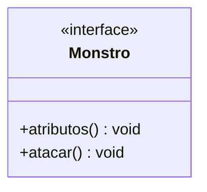
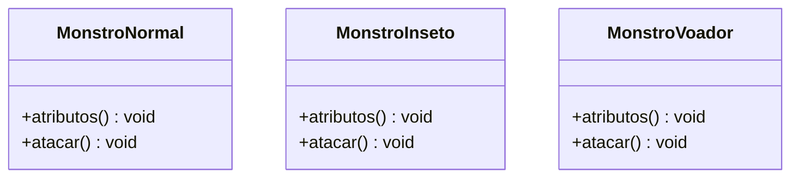
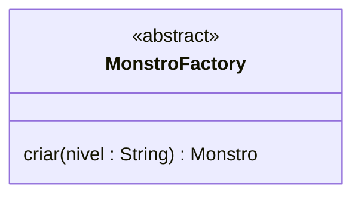

# Design Patters

Aqui abordaremos os principais Design Patters, também conhecidos como Padrões de Projetos, mais utilizados no mercado atual, mas antes de começarmos primeiro devemos fazer uma pergunta, por que utilizar Padrões de Projetos? Os Padrões de Projetos foram criados para solucionar problemas recorrentes das formas mais eficientes até então encontradas, aplicando Padrão de Projeto podemos maximizar a eficiência, não necessitando focar em criar soluções para problemas que já foram solucionados.<br>
Vamos dividir os padrões em três categorias que são:

- Padrões de Projetos Criacionais
- Padrões de Projetos Estruturais
- Padrões de Projetos Comportamentais

A linguagem utilizada para implementar os exemplos é o Java na versão 8.

Então, vamos aos estudos!

## Padrões de Projetos Criacionais

Os Padrões de Projetos Criacionais são utilizados quando precisamos padronizar a criação de objetos quando a sua criação exigem uma maior complexidade, não apenas instanciando um novo objeto com **new**.

### Factory Method

O padrão Factory Method pode ser utilizado quando os objetos criados precisam variar dentro de um mesmo **modelo**, com ela colocamos as regras de criação dentro da Factory e ao invocá-la passamos por parâmetro o que desejamos que seja criado.

**Exemplo**

Estamos criando um jogo que é dividido por níveis, em cada nível precisamos criar um tipo de monstro diferente conforme abaixo:

- Nível 1: monstros do tipo normal
- Nível 2: monstros do tipo inseto
- Nível 3: monstros do tipo voador

Abaixo temos o modelo base dos monstros representado por uma interface:



Agora temos a três classes que implementam o modelo criando um monstro de cada tipo:



Agora criamos nossa Factory que possui a lógica de criação dos monstros utilizando como parâmetro o nível que é passado:



Por fim no cliente para criarmos um montro, basta invovar a Factory e passmos o nível que queremos:

```
    Monstro monstro1 = MonstroFactory.criar("nivel1");
```

No exemplo acima utilizamos uma variação da Factory Method chamada **Simple Factory**, abaixo a implementação em código:

[Exemplo](https://github.com/augustocesarsousa/design-patterns/tree/main/src/main/java/br/com/designpatters/creational/factoryMethod)
