# Design Patters

Aqui abordaremos os principais Design Patters, também conhecidos como Padrões de Projetos, mais utilizados no mercado atual, mas antes de começarmos primeiro devemos fazer uma pergunta, por que utilizar Padrões de Projetos? Os Padrões de Projetos foram criados para solucionar problemas recorrentes das formas mais eficientes até então encontradas, aplicando Padrão de Projeto podemos maximizar a eficiência, não necessitando focar em criar soluções para problemas que já foram solucionados.<br>
Vamos dividir os padrões em três categorias que são:

- Padrões de Projetos Criacionais
- Padrões de Projetos Estruturais
- Padrões de Projetos Comportamentais

A linguagem utilizada para implementar os exemplos é o Java na versão 8.

Então, vamos aos estudos!

## Padrões de Projetos Criacionais

Os Padrões de Projetos Criacionais são utilizados quando precisamos padronizar a criação de objetos onde a sua criação exigem uma maior complexidade, não apenas instanciando um novo objeto com **new**.

### Factory Method

O padrão Factory Method pode ser utilizado quando os objetos criados precisam variar dentro de um mesmo **modelo**, com ela colocamos as regras de criação dentro da Factory e ao invocá-la passamos por parâmetro o que desejamos que seja criado.

**Exemplo**

Estamos criando um jogo que é dividido por níveis, em cada nível precisamos criar um tipo de monstro diferente conforme abaixo:

- Nível 1: monstros do tipo normal
- Nível 2: monstros do tipo inseto
- Nível 3: monstros do tipo voador

Abaixo temos o modelo base dos monstros representado por uma interface:

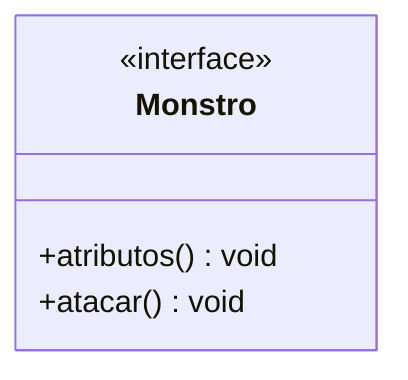

Agora temos a três classes que implementam o modelo criando um monstro de cada tipo:

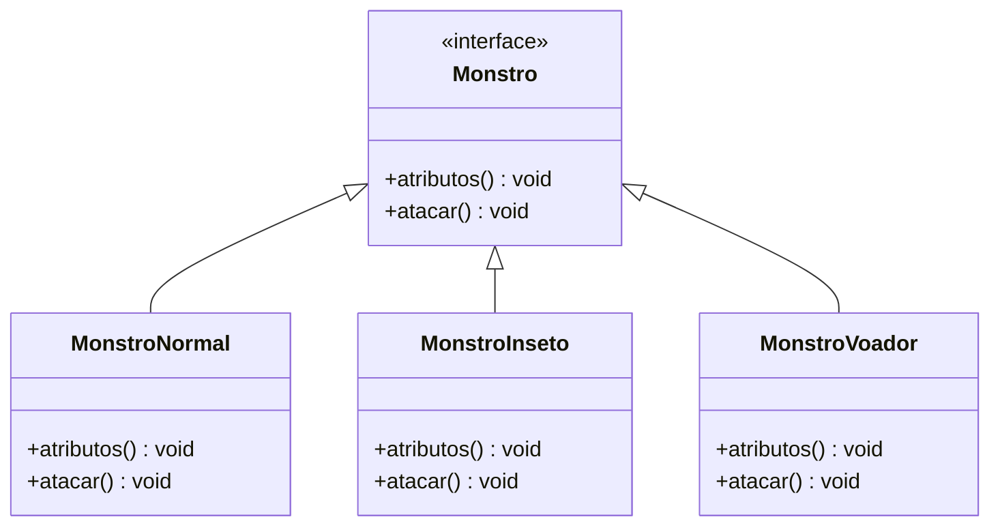

Agora criamos nossa Factory que possui a lógica de criação dos monstros utilizando como parâmetro o nível que é passado:

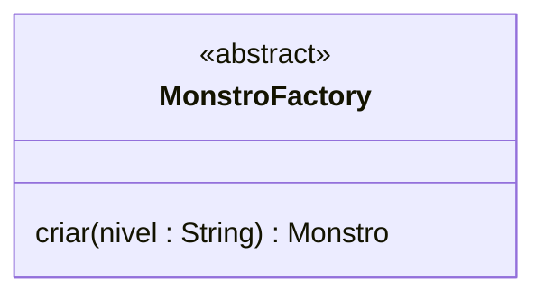

Por fim no cliente para criarmos um monstro, basta invovar a Factory e passarmos o nível que queremos, simplificando a criação com uma única linha de comando:

```
    Monstro monstro1 = MonstroFactory.criar("nivel1");
```

No exemplo acima utilizamos uma variação da Factory Method chamada **Simple Factory**, abaixo a implementação em código:

[Exemplo](https://github.com/augustocesarsousa/design-patterns/tree/main/src/main/java/br/com/design_patters/creational/factory_method)

### Abstract Factory Method

O padrão Abstract Factory Method é utilizado quando precisamos criar objetos que pertencem a uma mesma **família** de objetos ou possuem uma relação entre si.

**Exemplo**

Vamos continuar utilizando o exemplo do jogo, mas agora queremos criar um **grupo** de objetos, esse grupo será formado por um **mapa** e um **monstro** relacionado a esse mapa, com isso evitamos a criação de **mapas/monstros** que não possuem relação, exemplo, colocar um monstro do tipo **água** em um mapa de **fogo**, portanto temos abaixo os três modelos:

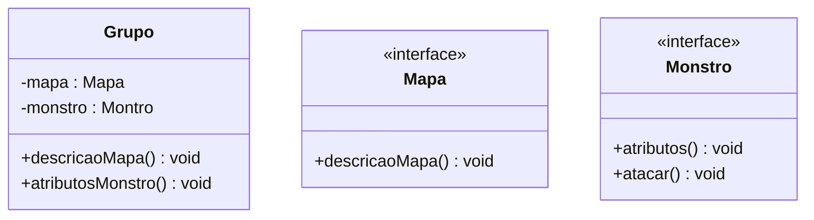

Agora temos as classes que implementam as interfaces **Mapa** e **Monstro**:

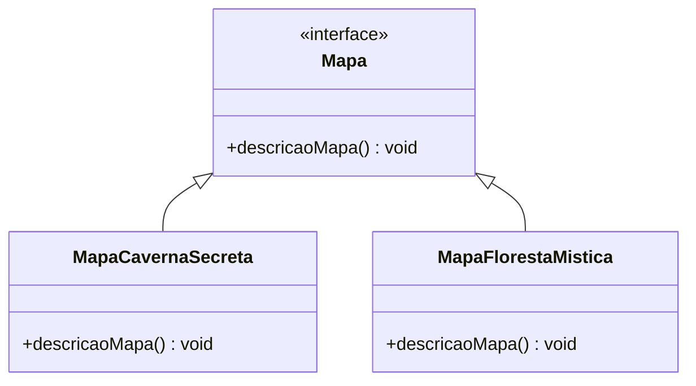

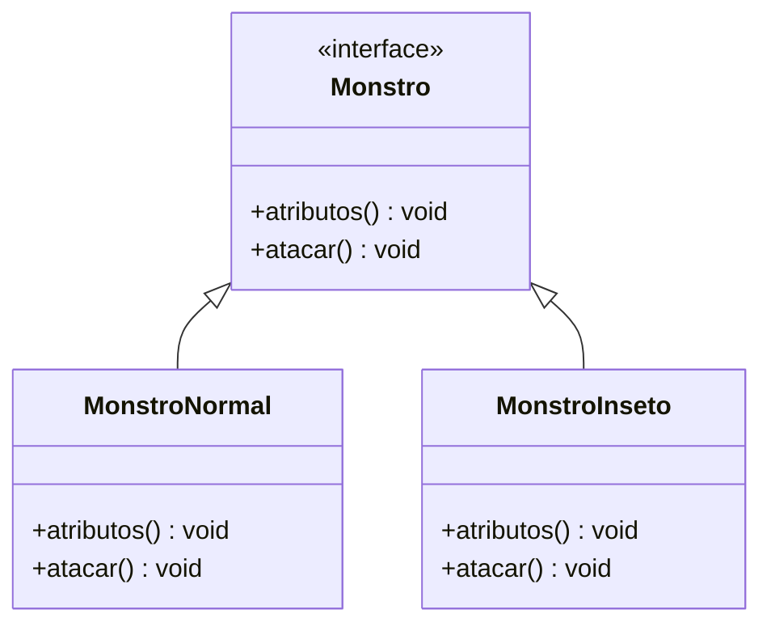

Agora temos a Abstract Factory que abstrai toda a lógica de criação dos nossos grupos através do nível informado:

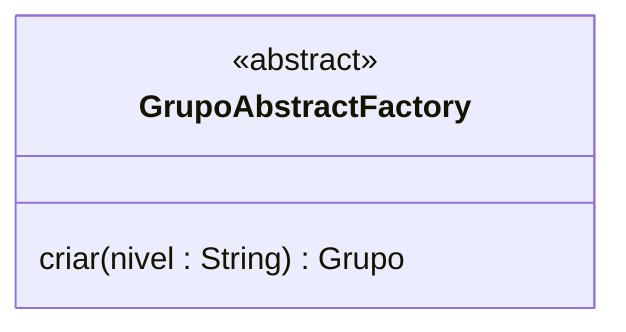

Agora no cliente basta invocarmos a Abstract Factory e passar o nível do grupo que queremos:

```
    Grupo grupoNivel1 = GrupoAbstractFactory.criar("nivel1");
```

Abaixo a implementação em código:

[Exemplo](https://github.com/augustocesarsousa/design-patterns/tree/main/src/main/java/br/com/design_patters/creational/abstract_factory_method)

### Singleton

O padrão Singleton é utilizado quando precisamos criar um objeto **mutável** de instância **única** que é compartilhado globalmente dentro do nosso sistema, assim quando uma alteração é feita nesse objeto ela é observada por todos os objetos que o possuem em sua composição.

Para criarmos um objeto de instância única fazemos com que ele instancie a si mesmo dentro do seu método construtor, depois modificamos o acesso do seu construtor como privado para que ele não possa ser instanciado por outro objeto, por fim criamos um método que possa prover essa instância quando ele é invocado.

**Exemplo**

Agora em nosso jogo queremos criar um objeto **Dia** que será compartilhado pelos mapas, esse objeto irá conter a data e o turno que será um **enum** com os turnos do dia (manhã, tarde e noite), esse objeto terá uma única instância porque não queremos mapas com dias e turnos diferentes, abaixo temos os modelos:

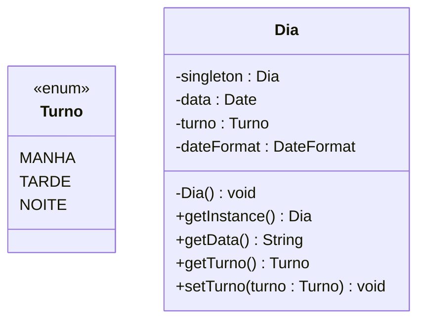

Agora adicionamos o atributo **dia** no nosso modelo de **mapa**:

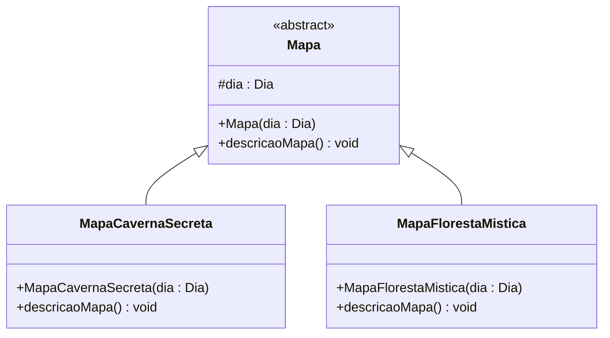

Agora quando quisermos criar nossos mapas passamos a instância do **dia** por parâmetro, assim todos os mapas criados terão os mesmos dados do **dia** e quando uma alteração é feita no **dia** todos os mapas enxergarão essa mudança.

Abaixo a implementação desse padrão em código:

[Exemplo](https://github.com/augustocesarsousa/design-patterns/tree/main/src/main/java/br/com/design_patters/creational/singleton)

### Builder

Utilizamos o padrão Buider quando queremos criar representações diferentes de um mesmo objeto complexo, exemplo, queremos criar um objeto **pessoa** que possui vários atributos, porém, na hora da criação do objeto nem todas as pessoas irão possuir os mesmos atributos, uma pessoa pode ter um e-mail, outra não, uma pessoa pode ter dois números de telefone, outra apenas um, e por aí vai. A forma padrão de criarmos essas representações seria através da sobrecarga do método construtor, porém em objetos com muitos atributos isso se torna inviável, é nesse cenário que o Builder entra.

**Exemplo**

Vamos utilizar como exemplo a criação dos personagens do nosso jogo, o Builder nos dá a opção de definir que alguns atributos sejam obrigatórios, no nosso caso vamos definir o nome e o tipo do personagem como atributos obrigatórios, os outros atributos serão definidos conforme cada tipo de personagem onde o tipo será um enum com as classes (arqueiro, guerreiro ou mago), temos abaixo os modelos:

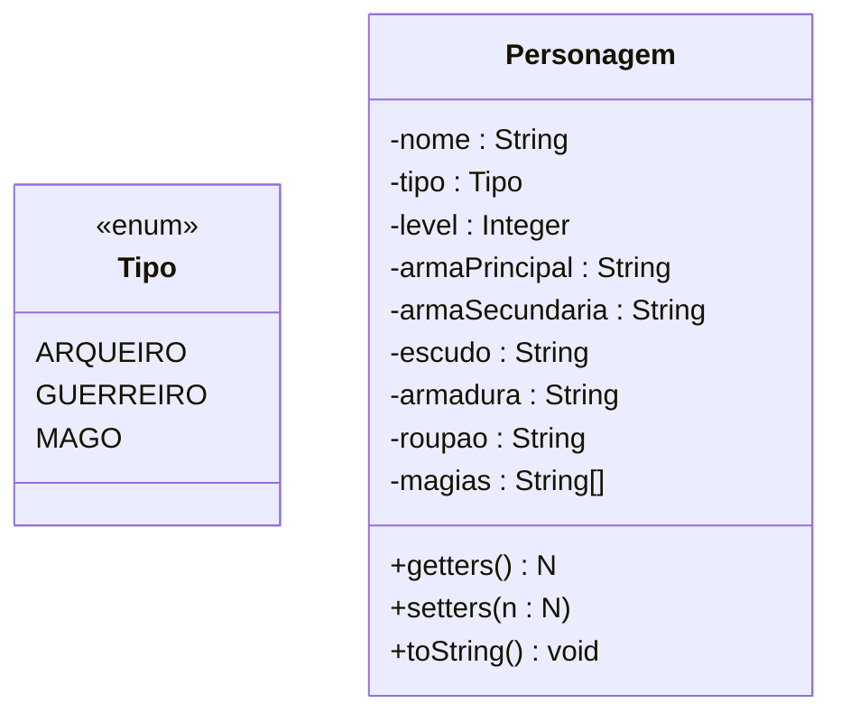

Agora criamos nosso Builder que será responsável pela criação dos personagens:

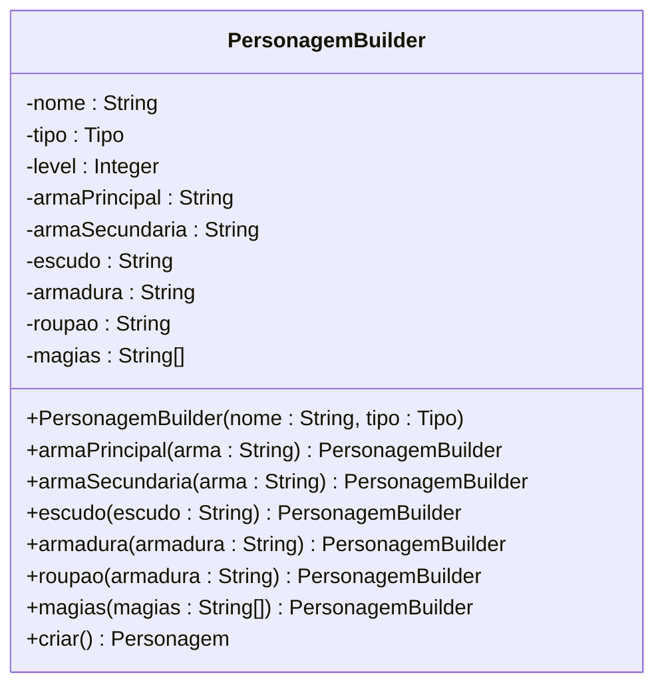

Agora no cliente, para criarmos o personagem chamamos o Builder e informamos os atributos que desejamos:

```
    Personagem personagem = new PersonagemBuilder("Légolas", Tipo.ARQUEIRO)
        .armaPrincipal("Arco Leve")
        .armaSecundaria("Espada Leve")
        .armadura("Armadura Leve")
        .magias(Arrays.asList("Flecha de Vento", "Esgrima Élfica"))
        .criar();
```

No exemplo acima, utilizamos uma variação do Builder chamada **fluent**, abaixo a implementação em código:

[Exemplo](https://github.com/augustocesarsousa/design-patterns/tree/main/src/main/java/br/com/design_patters/creational/builder)
