# Design Patters

Aqui abordaremos os principais Design Patters, também conhecidos como Padrões de Projetos, mais utilizados no mercado atual, mas antes de começarmos primeiro devemos fazer uma pergunta, por que utilizar Padrões de Projetos? Os Padrões de Projetos foram criados para solucionar problemas recorrentes das formas mais eficientes até então encontradas, aplicando Padrão de Projeto podemos maximizar a eficiência, não necessitando focar em criar soluções para problemas que já foram solucionados.<br>
Vamos dividir os padrões em três categorias que são:

- Padrões de Projetos Criacionais
- Padrões de Projetos Estruturais
- Padrões de Projetos Comportamentais

A linguagem utilizada para implementar os exemplos é o Java na versão 8.

Então, vamos aos estudos!

## Padrões de Projetos Criacionais

Os Padrões de Projetos Criacionais são utilizados quando precisamos padronizar a criação de objetos onde a sua criação exigem uma maior complexidade, não apenas instanciando um novo objeto com **new**.

### Factory Method

O padrão Factory Method pode ser utilizado quando os objetos criados precisam variar dentro de um mesmo **modelo**, com ela colocamos as regras de criação dentro da Factory e ao invocá-la passamos por parâmetro o que desejamos que seja criado.

**Exemplo**

Estamos criando um jogo que é dividido por níveis, em cada nível precisamos criar um tipo de monstro diferente conforme abaixo:

- Nível 1: monstros do tipo normal
- Nível 2: monstros do tipo inseto
- Nível 3: monstros do tipo voador

Abaixo temos o modelo base dos monstros representado por uma interface:

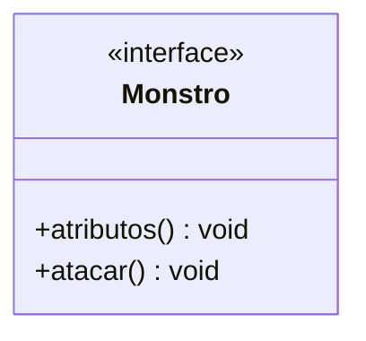

Agora temos a três classes que implementam o modelo criando um monstro de cada tipo:

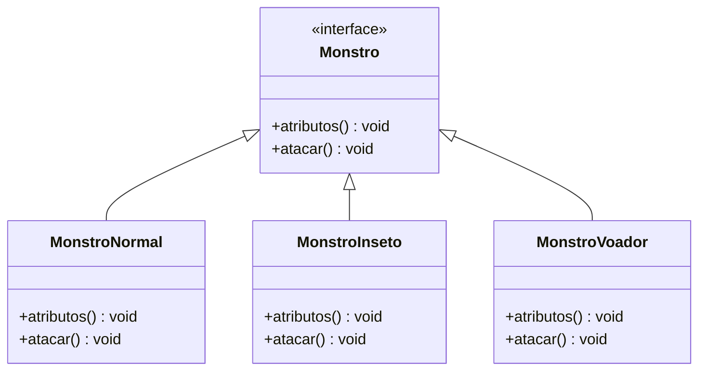

Agora criamos nossa Factory que possui a lógica de criação dos monstros utilizando como parâmetro o nível que é passado:

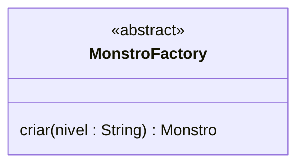

Por fim no cliente para criarmos um monstro, basta invovar a Factory e passarmos o nível que queremos, simplificando a criação com uma única linha de comando:

```
    Monstro monstro1 = MonstroFactory.criar("nivel1");
```

No exemplo acima utilizamos uma variação da Factory Method chamada **Simple Factory**, abaixo a implementação em código:

[Exemplo](https://github.com/augustocesarsousa/design-patterns/tree/main/src/main/java/br/com/design_patters/creational/factory_method)

### Abstract Factory Method

O padrão Abstract Factory Method é utilizado quando precisamos criar objetos que pertencem a uma mesma **família** de objetos ou possuem uma relação entre si.

**Exemplo**

Vamos continuar utilizando o exemplo do jogo, mas agora queremos criar um **grupo** de objetos, esse grupo será formado por um **mapa** e um **monstro** relacionado a esse mapa, com isso evitamos a criação de **mapas/monstros** que não possuem relação, exemplo, colocar um monstro do tipo **água** em um mapa de **fogo**, portanto temos abaixo os três modelos:

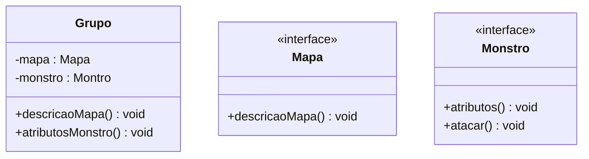

Agora temos as classes que implementam as interfaces **Mapa** e **Monstro**:

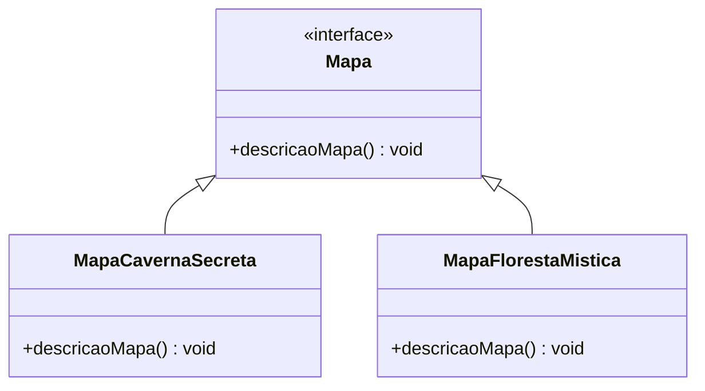

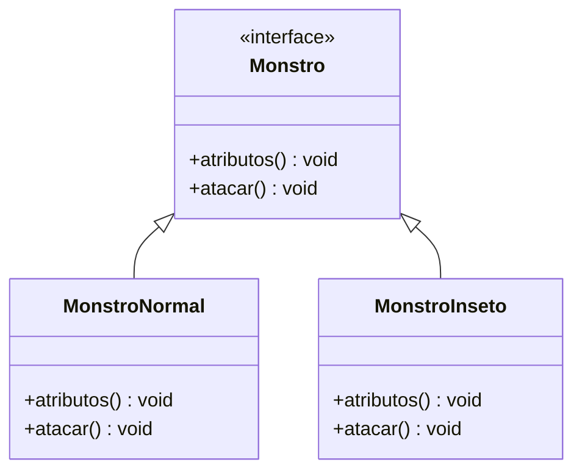

Agora temos a Abstract Factory que abstrai toda a lógica de criação dos nossos grupos através do nível informado:

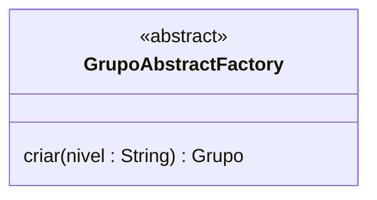

Agora no cliente basta invocarmos a Abstract Factory e passar o nível do grupo que queremos:

```
    Grupo grupoNivel1 = GrupoAbstractFactory.criar("nivel1");
```

Abaixo a implementação em código:

[Exemplo](https://github.com/augustocesarsousa/design-patterns/tree/main/src/main/java/br/com/design_patters/creational/abstract_factory_method)

### Singleton

O padrão Singleton é utilizado quando precisamos criar um objeto **mutável** de instância **única** que é compartilhado globalmente dentro do nosso sistema, assim quando uma alteração é feita nesse objeto ela é observada por todos os objetos que o possuem em sua composição.

Para criarmos um objeto de instância única fazemos com que ele instancie a si mesmo dentro do seu método construtor, depois modificamos o acesso do seu construtor como privado para que ele não possa ser instanciado por outro objeto, por fim criamos um método que possa prover essa instância quando ele é invocado.

**Exemplo**

Agora em nosso jogo queremos criar um objeto **Dia** que será compartilhado pelos mapas, esse objeto irá conter a data e o turno que será um **enum** com os turnos do dia (manhã, tarde e noite), esse objeto terá uma única instância porque não queremos mapas com dias e turnos diferentes, abaixo temos os modelos:

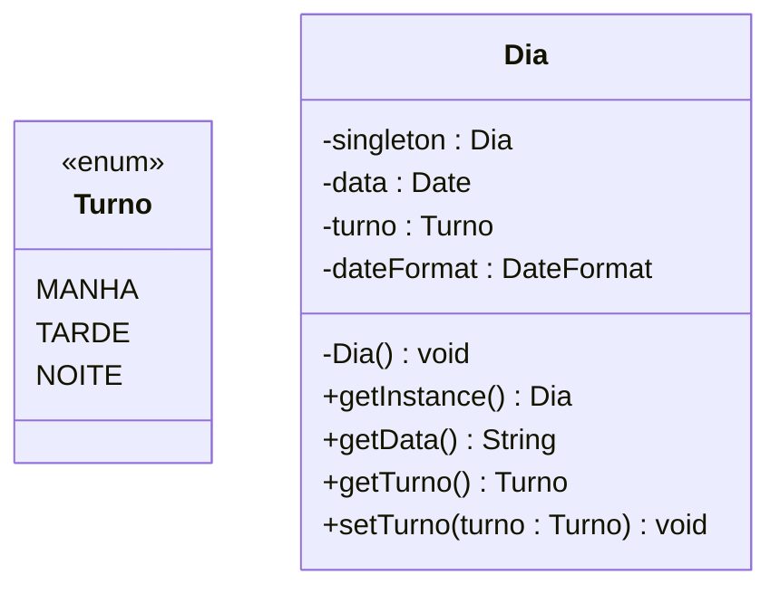

Agora adicionamos o atributo **dia** no nosso modelo de **mapa**:

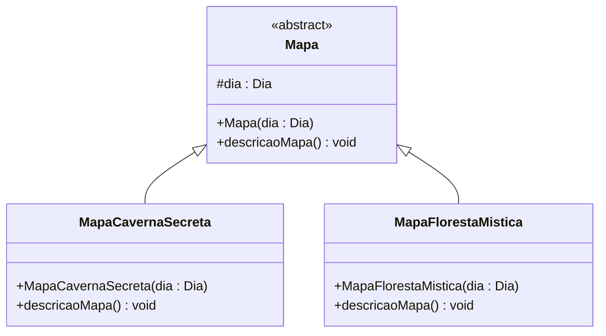

Agora quando quisermos criar nossos mapas passamos a instância do **dia** por parâmetro, assim todos os mapas criados terão os mesmos dados do **dia** e quando uma alteração é feita no **dia** todos os mapas enxergarão essa mudança.

Abaixo a implementação desse padrão em código:

[Exemplo](https://github.com/augustocesarsousa/design-patterns/tree/main/src/main/java/br/com/design_patters/creational/singleton)

### Builder

Utilizamos o padrão Buider quando queremos criar representações diferentes de um mesmo objeto complexo, exemplo, queremos criar um objeto **pessoa** que possui vários atributos, porém, na hora da criação do objeto nem todas as pessoas irão possuir os mesmos atributos, uma pessoa pode ter um e-mail, outra não, uma pessoa pode ter dois números de telefone, outra apenas um, e por aí vai. A forma padrão de criarmos essas representações seria através da sobrecarga do método construtor, porém em objetos com muitos atributos isso se torna inviável, é nesse cenário que o Builder entra.

**Exemplo**

Vamos utilizar como exemplo a criação dos personagens do nosso jogo, o Builder nos dá a opção de definir que alguns atributos sejam obrigatórios, no nosso caso vamos definir o nome e o tipo do personagem como atributos obrigatórios, os outros atributos serão definidos conforme cada tipo de personagem onde o tipo será um enum com as classes (arqueiro, guerreiro ou mago), temos abaixo os modelos:

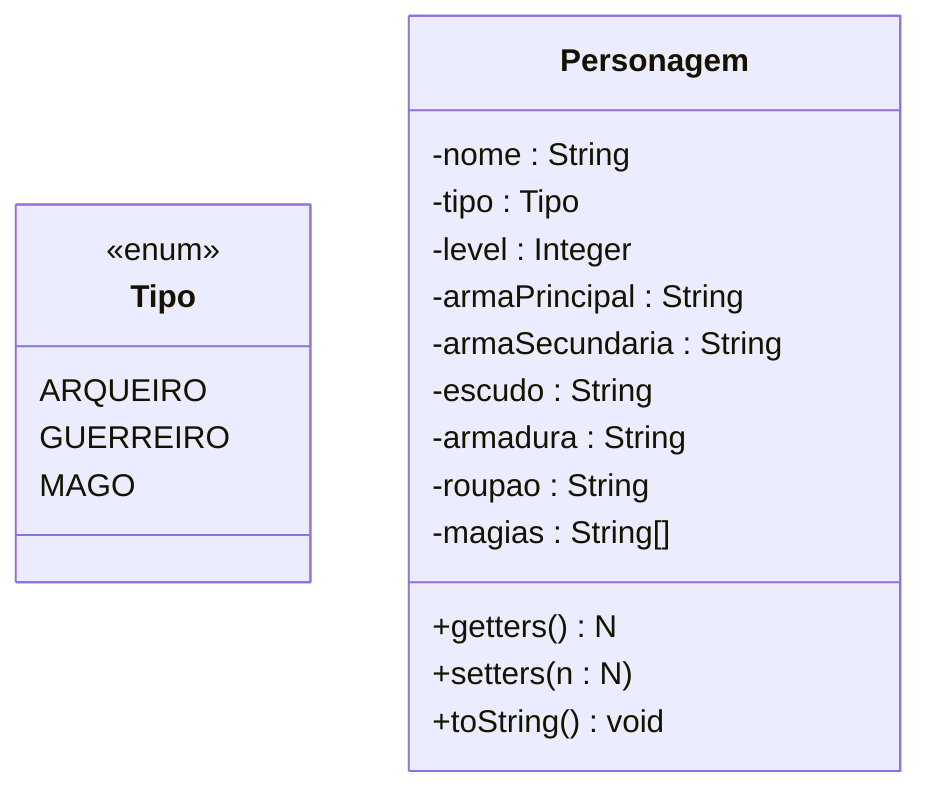

Agora criamos nosso Builder que será responsável pela criação dos personagens:

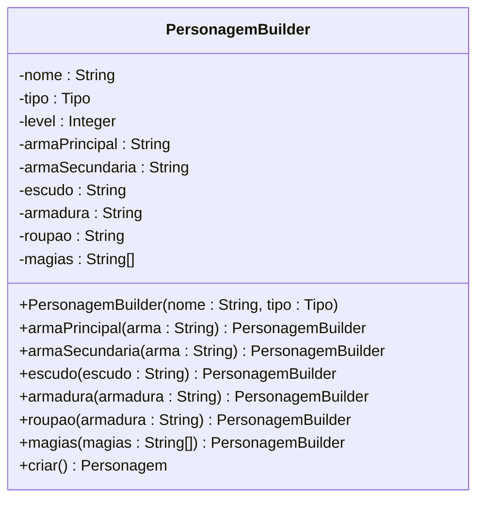

Agora no cliente, para criarmos o personagem chamamos o Builder e informamos os atributos que desejamos:

```
    Personagem personagem = new PersonagemBuilder("Légolas", Tipo.ARQUEIRO)
        .armaPrincipal("Arco Leve")
        .armaSecundaria("Espada Leve")
        .armadura("Armadura Leve")
        .magias(Arrays.asList("Flecha de Vento", "Esgrima Élfica"))
        .criar();
```

No exemplo acima, utilizamos uma variação do Builder chamada **fluent**, abaixo a implementação em código:

[Exemplo](https://github.com/augustocesarsousa/design-patterns/tree/main/src/main/java/br/com/design_patters/creational/builder)

### Prototype

Utilizamos o padrão Prototype quando queremos criar um objeto a partir de um objeto pré-existente onde desejamos alterar algumas características, evitando a criação de um objeto do zero. Praticamente o Prototype é um **clone** do objeto original, o Java já possui uma interface que faz o clone de um objeto, mas caso precisemos podemos alterar o método para cumprir as especificações que desejamos.

**Exemplo**

Agora em nosso jogo queremos criar monstros diferentes dentro da mesma espécie, porém não queremos criar um monstro do zero, então, utilizamos o Prototype para fazer um clone de um monstro já existente e alteramos as características que desejamos, temos o modelo abaixo:

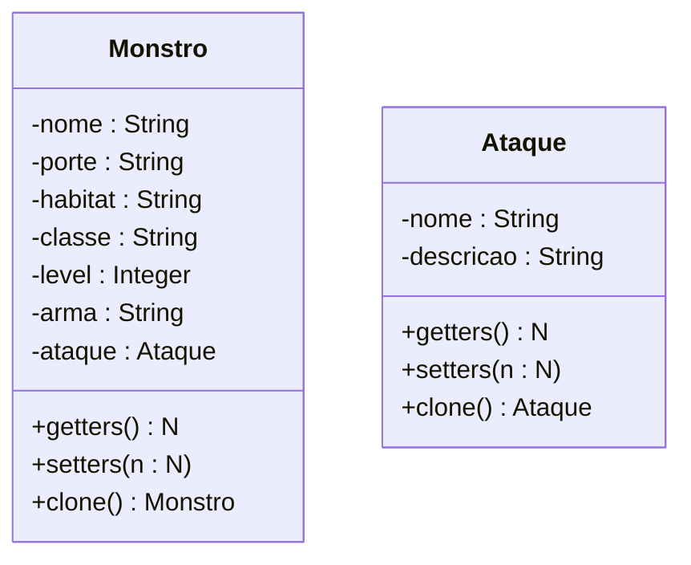

No cliente criaremos dois monstros onde um será da classe **Soldado** e o outro será um **Chefe**, que foi clonado de um soldado e foram feitas as alterações.

Abaixo, temos a implementação em código:

[Exemplo](https://github.com/augustocesarsousa/design-patterns/tree/main/src/main/java/br/com/design_patters/creational/prototype)

## Padrões de Projetos Estruturais

Os padrões estruturais são utilizados quando precisamos estruturar objetos e classes de forma extensível e flexível.

### Adapter

Utilizamos o padrão Adapter quando precisamos adaptar um objeto ou classe de forma que ele possa se integrar com outros objetos e classes não compatíveis previamente. Usando um exemplo no mundo real, quando utilizamos um adaptador de tomadas onde nossa tomada possiu três pinos, porém o plug da parede possui apenas dois, utilizamos então um adaptador para fazer a tomada de três pinos encaixar no plug de dois.

**Exemplo**

Vamos utilizar como exemplo um computador que possui uma porta HDMI e queremos conectá-lo a uma TV que também possui uma porta HDMI, essa conexão irá funcionar sem problemas e o computador transmitirá vídeo e áudio para a TV, porém agora queremos conectar o mesmo computador só que em um monitor que possui apenas um porta VGA, então utilizamos um adaptador que fará a conexão e irá converter o sinal vindo da porta HDMI do computador para a porta VGA do monitor porém o monitor não irá reproduzir áudio, porque o cabo VGA transmite apenas sinal de vídeo. Vamos representar este senário em forma de objetos.

Primeiro criamos as interfaces HDMI e VGA com seus respectivos métodos:

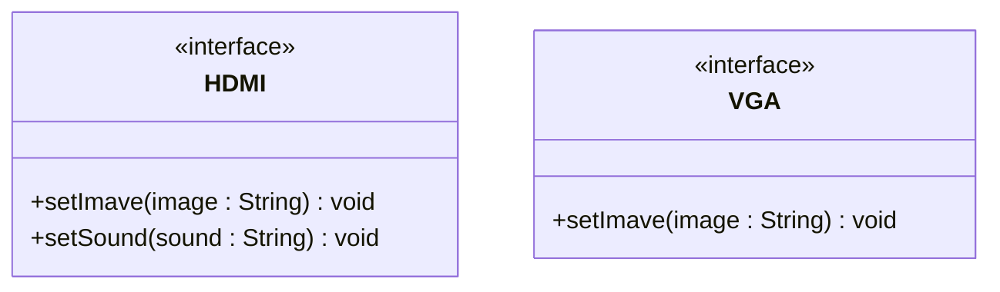

Agora criamos os dispositivos TV e OldMonitor, que implementam as interfaces:

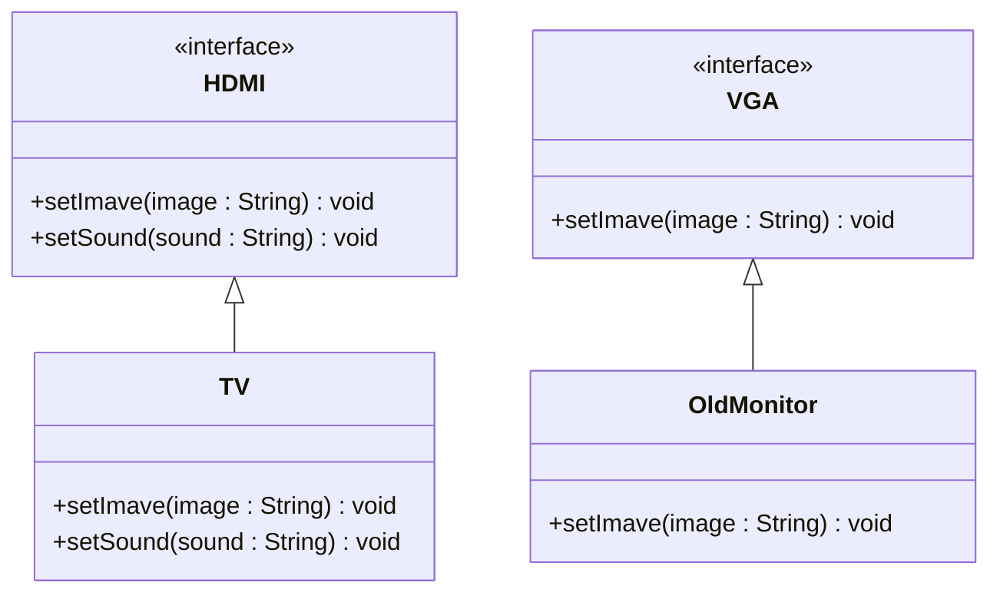

Agora criamos nosso computador com uma porta HDMI:

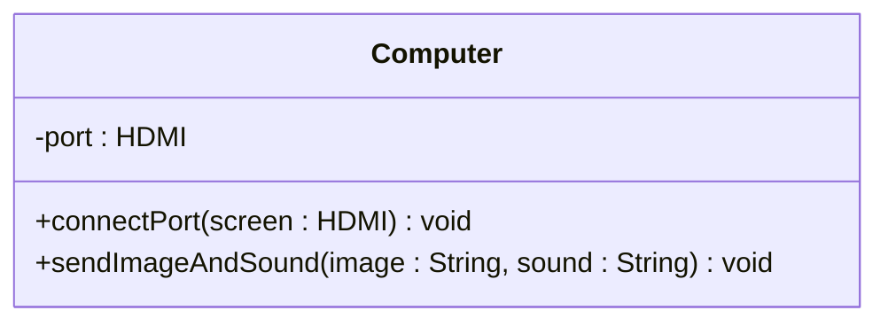

Agora criamos o nosso adaptador que implementa a interface HDMI fará a conexão da porta HDMI do computador para a porta VGA do monitor:

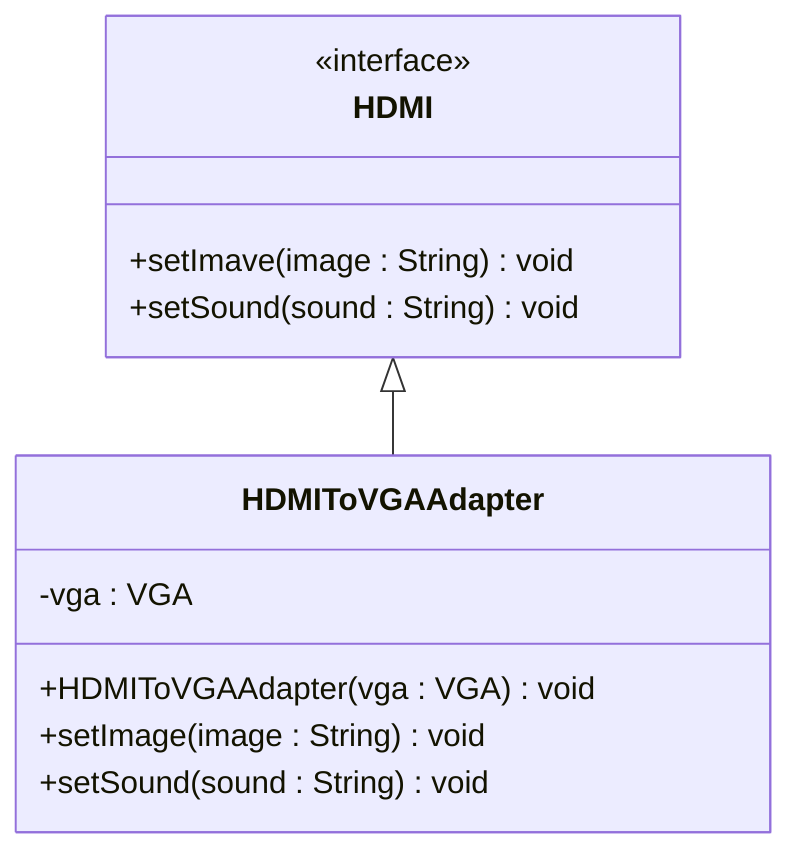

Por fim no nosso cliente instanciamos nosso objetos e fazemos as conexões:

```
    System.out.println("Computer with TV");
    Computer computer = new Computer();
    TV tv = new TV();
    computer.connectPort(tv);
    computer.sendImageAndSound("Trailer Avengers", "Sound theme");

    System.out.println("Computer with Old monitor");
    Computer computer2 = new Computer();
    OldMonitor oldMonitor = new OldMonitor();
    computer2.connectPort(new HDMIToVGAAdapter(oldMonitor));
    computer2.sendImageAndSound("Trailer Justice League", "Sound theme");
```

Abaixo temos a implementação do código:

[Exemplo](https://github.com/augustocesarsousa/design-patterns/tree/main/src/main/java/br/com/design_patters/structural/adapter)

### Bridge

Utilizamos o padrão Bridge quando precisamos que a abstração e a implementação possam variar independentemente em tempo de execução.

**Exemplo**

Temos um sistema de cadastro de funcionários e queremos encaminhar os dados para outros dois sistemas, um sistema lê dados em formato CSV e o outro lê dados em formato JSON, utilizamos o padrão Bridge para criarmos essa "ponte" entre os dados e os sistemas fazendo que as informações possam ser convertidas da forma que desejamos, no diagrama abaixo temos:

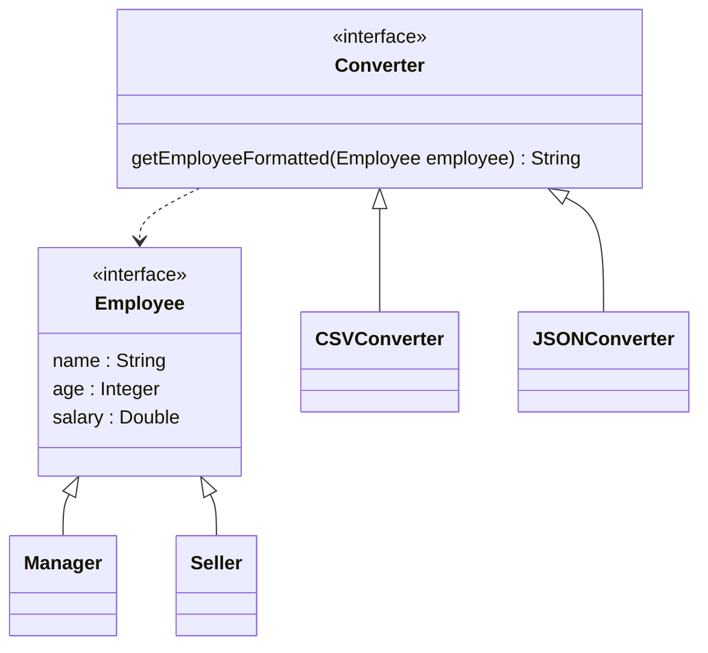

Analisando o diagrama, nós temos a abstração **Employee** que define um funcionário representado por uma **interface** e duas implementações, **Manager** e **Seller**, depois temos a abstração **Converter** com o método **getEmployeeFormatted** que define a formatação do **Employee** informado, e duas implementações, **CSVConverter** que irá converter o **Employee** para CSV e **JSONConverter** que irá converter o **Employee** para JSON. Desta forma podemos converter o mesmo Employee tanto para CSV quanto para JSON em tempo de execução e não precisando criar uma implementação para cada tipo de Employee.

Abaixo temos a implementação em código:

[Exemplo](https://github.com/augustocesarsousa/design-patterns/tree/main/src/main/java/br/com/design_patters/structural/bridge)

### Composite

Utilizamos o padrão Composite quando queremos que um objeto ou um conjunto deles possam ser tratados de forma transparente, sem diferenças. Para isso definimos uma composição que contenha tanto um único objeto quanto um conjunto dos mesmos elementos, representando estruturas hierárquicas.

**Exemplo**

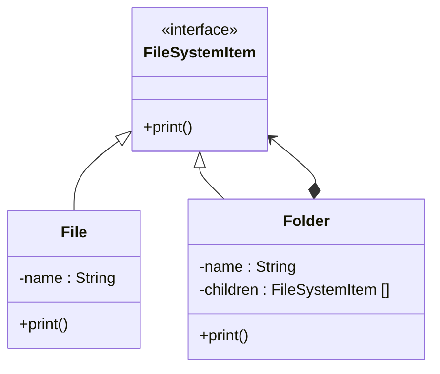

Analisando o diagrama acima temos dois objetos distintos, **File** que representa uma **parte** e o **Folder** que representa um **todo**, agora pra tratarmos esses objetos da mesma forma temos um interface **FileSystemItem** onde tanto o **File** quanto o **Folder** implementam essa interface, notamos também que dentro do Folder temos um atributo **children** que é uma lista de FIleSystemItem, ou seja, dentro do Folder podemos ter outros Folders ou Files representando assim uma recursividade.

Abaixo temos a representação em código:

[Exemplo](https://github.com/augustocesarsousa/design-patterns/tree/main/src/main/java/br/com/design_patters/structural/composite)

### Decorator

Utilizamos o padrão Decorator quando queremos adicionar funcionalidades dinamicamente em um objeto.

**Exemplo**

Vamos utilizar como exemplo a criação de bebidas onde temos a **interface** **Drink** que fornece o modelo da bebida, depois temos duas bebidas **Coffee** e **Tea** que implementam a interface Drink. Agora queremos adicionar um pouco de leite ao nosso café criando então um **CoffeWithMilk**, poderíamos criar um nova classe que estenderia a classe Coffee, mas supondo que temos **N** combinações para nosso café, seria necessário criar uma classe para cada nova funcionalidade, o padrão **Decorator** serve para nos auxiliar nesses tipos de situações onde nós "decoramos" a classe que queremos e adicionamos a nova funcionalidade, vamos analisar o diagrama abaixo:

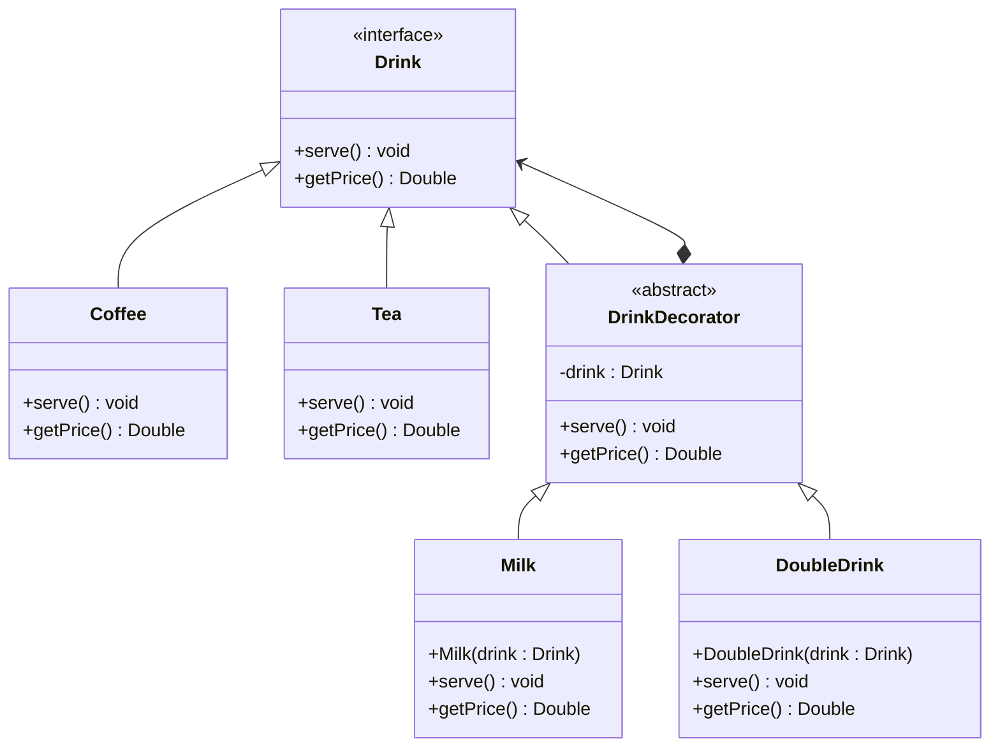

Conforme o diagrama, temos a interface **Drink** e as classes concretas **Coffee** e **Tea** que implementam a interface, temos também a classe abstrata **DrinkDecorator** que adiciona uma funcionalidade as classes concretas, por fim criamos duas funcionalidades **Milk** que adiciona leite a nossa bebida e **DoubleDrink** que dobra a quantidade da nossa bebida.

Abaixo temos a implementação em código:

[Exemplo](https://github.com/augustocesarsousa/design-patterns/tree/main/src/main/java/br/com/design_patters/structural/decorator)

### Facade

Utilizamos o padrão Facade quando queremos simplificar o acesso a serviços de um sistema complexo.

**Exemplo**

Vamos utilizar como exemplo um sistema bancário onde o cliente precisa ter acesso a alguns serviços do cartão de crédito, mas não podemos nossas entidades ao cliente, criamos então uma interface de acesso, abstraindo apenas as informações relevantes para os serviços solicitados, vamos analisar o diagrama abaixo:


No diagrama acima o cliente acessa a **BankFacade** que representa nossa interface de acesso aos serviços, dessa forma podemos simplificar e abstrair apenas o necessário para executar as operações, livrando o cliente da complexidade, diminuindo o acoplamento, aumentando o encapsulamento e a segurança do nosso sistema.

Abaixo temos a implementação em código:

[Exemplo](https://github.com/augustocesarsousa/design-patterns/tree/main/src/main/java/br/com/design_patters/structural/facade)

### Flyweight

Utilizamos o parão Flywaight quando queremos trabalhar com muitos objetos em memória de forma mais eficiente, com ele geramos uma espécie de **cache** onde armazenamos uma instância única com atributos intrínsecos de um objeto e ao chamarmos essa instância adicionamos os outros atributos extrínsecos.

**Exemplo**

Vamos utilizar como exemplo um streaming de música onde uma música possui valores intrínsecos (nome, autor, duração) e valores extrínsecos (quantidade de vezes que a música foi tocada), os valores intrínsecos podemos armazenar uma instância única em memória para todos os usuários e os valores extrínsecos nós inserimos para cada usuário.

Vamos analisar o diagrama abaixo:

```mermaid
classDiagram
    Client --|> MusicService
    MusicService *--|> Music
    MusicService --|> FlyweightFactory
    MusicService --|> MusicFlyweight    
    Music *--|> MusicFlyweight
    FlyweightFactory *--|> FlyweightFactory
    FlyweightFactory *--|> MusicFlyweight
    class MusicService {
        -memory
        +listenMusic()
        +report()
    }

    class Music {
        -musicFlyweight
        -playerCount
    }

    class FlyweightFactory {
        -repository : MusicFlyweight[]
        -instance : FlyweightFactory
        +getInstance() FlyweightFactory
        +getMusic() MusicFlyweight
    }

    class MusicFlyweight {
        -name
        -artist
        -duration
    }
```

No diagrama acima, temos o **Client** que acessa o **MusicService** que é resposável por devolver uma música quando solicitado, temos um **FlyweightFactory** que é responsável por criar uma instância do **Flyweight** por música, temos o **MusicFlyweight** com os valores intrínsecos e o **Music** que possui os valores extrínsecos que muda a cada vez em que a música é tocada.

Abaixo temos a implementação e código:

[Exemplo](https://github.com/augustocesarsousa/design-patterns/tree/main/src/main/java/br/com/design_patters/structural/flyweight)

### Mediator

Utilizamos o padrão Mediator quando precisamos reduzir o acoplamento entre objetos que precisam se comunicar, tornando a comunicação mais dinâmica. O Mediator funciona como um "garoto de recados" onde os objetos não precisam se conhecer, basta enviar a mensagem para o Mediator que ele irá entrega-la para o destinatário.

**Exemplo**

Vamos utilizar como exemplo um chat, onde os usuários não se conhecem diretamente, para isso utilizamos um Mediator que recebe a mensagem e a entrega para o destinatário, podemos ter Mediator específicos para funções diferentes, como um Mediator apenas que envia a mensagem e outro que antes de enviar faz a tradução para a língua nativa do destinatário.

Vamos analisar o diagrama abaixo:

```mermaid
classDiagram
    Mediator <|-- TranslateMediator
    Mediator <|-- ChatMediator
    Mediator <|--* User
    ChatMediator *--|> User
    TranslateMediator *--|> User
    User <|-- EnglishUser
    User <|-- ProtugueseUser
    class Mediator {
        <<abstract>>
        +addUser()
        +removeUser()
        +sendMessage(message, to, from)
    }
    class ChatMediator {
        +addUser()
        +removeUser()
        +sendMessage(message, to, from)
    }
    class TranslateMediator {
        +addUser()
        +removeUser()
        +sendMessage(message, to, from)
    }
    class User {
        <<abstract>>
        -name
        -language
        -mediator : Mediator
        +User(name, mediator)
        +sendMessage(message, to)
        receivedMessage(from, message)
    }

```

Temos então o nosso Mediator e duas variações, ChatMediator e TranslateMediator que são responsáveis por mandar e traduzir as mensagens, e temos o objeto User e suas variações EnglishUser e PortugueseUser, um para cada idioma, dessa forma, caso seja preciso adicionar novos idiomas basta criar outra variação.

Abaixo a implementação em código:

[Exemplo](https://github.com/augustocesarsousa/design-patterns/tree/main/src/main/java/br/com/design_patters/structural/mediator)

### Proxy

Utilizamos o padrão Proxy, quando queremos controlar o acesso a algum objeto, podendo modificar e ou adicionar funcionalidades.

**Exemplo**

Vamos utilizar como exemplo um sistema simplificado de um banco, onde o cliente pode acessar o objeto **Banco** e executar suas operação e também pode acessar o objeto **Caixa Eletrônico** e executar suas operações porém com algumas restrições é nesse ponto onde inserimos o Proxy.

Vamos analisar o diagrama abaixo:

```mermaid
classDiagram
    Client ..> BankOperations
    Client ..> Bank
    Client ..> ATM
    BankOperations <|-- Bank
    BankOperations <|-- ATM
    BankOperations <|--* ATM
    class BankOperations {
        <<interface>>
        +deposit()
        +withdraw()
        +changePassword()
    }
    class Bank {
        +deposit()
        +withdraw()
        +changePassword()
    }
    class ATM {
        -bank : BankOperations
        +ATM(bank)
        +deposit()
        +withdraw()
        +changePassword()
    }
```

Temos então nosso Client que pode acessar o Bank e o ATM para executar sua operações, os objetos Bank e ATM implementam a interface BankOperations que define as operações que serão realizadas, porém o ATM possuem a implementação de um Proxy que faz um contro nas operações definindo certas limitações.

Abaixo temos a implementação em código:

[Exemplo](https://github.com/augustocesarsousa/design-patterns/tree/main/src/main/java/br/com/design_patters/structural/proxy)

## Padrões de Projetos Comportamentais

Os Padrões de Projetos Comportamentais são utilizados quando queremos definir como as responsabilidades são programadas, como os objetos se comunicam a fim de reforçar princípios da Orientação a Objeto como o baixo acoplamento.

### Chain of Responsibility

O primeiro padrão que abordaremos nesse tópico é o Chain of Responsibility, esse padrão é utilizados quando queremos evitar o acoplamento entre o remetente de uma solicitação e seu receptor, podem fazer com que mais de um objeto possa atender a mesma requisição. Esse padrão usa com princípio uma "corrente" onde cada objeto chamada executa uma tarefa e chama e próximo caso seja necessário.

**Exemplo**

Vamos usar como exemplo um caixa eletrônico onde informamos o valor do saque que queremos fazer e o processamento dentro do caixa irá analisar as notas disponíveis e retornará as quantidades necessárias. De uma forma mais simples podemos fazer esse processamento utilizando uma cadeia de **IFs** e **Elses** para analisar os valores das notas, porém dessa forma todas as nossas validações estaria embutidas dentro de uma mesma classe agregando um alto acoplamento em nosso sistema, aplicando o Chain of Resposibility podemos dividir as tarefas em outros objetos onde cada um será responsável por analisar um valor de nota, executar uma ação e caso necessário, chamar o próximo objeto.

Vamos analizar o diagrama abaixo:

```mermaid
classDiagram
    Dispenser *--|> Bill
    Bill *--|> Bill    
    Bill <.. BillOf1Instance
    Bill <.. BillOf10Instance
    Bill <.. BillOf20Instance
    Bill <.. BillOf50Instance
    Bill <.. BillOf100Instance
    class Dispenser {
        -chain : Bill
        +withdraw(value)
    }
    class Bill {
        -value : Integer
        -next : Bill
        +execute()
    }
```

Analisando o diagrama acima temos o objeto **Bill** que representa uma nota com seu valor e o link para a próxima nota que deve ser chamada, temos abaixo as instâncias de notas com valores diferentes e por fim o **Dispenser** que é responsável por montar essa cadeia de notas e implementar o método de saque.

No link abaixo temos a implementação em código:

[Exemplo](https://github.com/augustocesarsousa/design-patterns/tree/main/src/main/java/br/com/design_patters/behavioral/chainOfResponsibility)