# Design Patters

Aqui abordaremos os principais Design Patters, também conhecidos como Padrões de Projetos, mais utilizados no mercado atual, mas antes de começarmos primeiro devemos fazer uma pergunta, por que utilizar Padrões de Projetos? Os Padrões de Projetos foram criados para solucionar problemas recorrentes das formas mais eficientes até então encontradas, aplicando Padrão de Projeto podemos maximizar a eficiência, não necessitando focar em criar soluções para problemas que já foram solucionados.<br>
Vamos dividir os padrões em três categorias que são:

- Padrões de Projetos Criacionais
- Padrões de Projetos Estruturais
- Padrões de Projetos Comportamentais

A linguagem utilizada para implementar os exemplos é o Java na versão 8.

Então, vamos aos estudos!

## Padrões de Projetos Criacionais

Os Padrões de Projetos Criacionais são utilizados quando precisamos padronizar a criação de objetos onde a sua criação exigem uma maior complexidade, não apenas instanciando um novo objeto com **new**.

### Factory Method

O padrão Factory Method pode ser utilizado quando os objetos criados precisam variar dentro de um mesmo **modelo**, com ela colocamos as regras de criação dentro da Factory e ao invocá-la passamos por parâmetro o que desejamos que seja criado.

**Exemplo**

Estamos criando um jogo que é dividido por níveis, em cada nível precisamos criar um tipo de monstro diferente conforme abaixo:

- Nível 1: monstros do tipo normal
- Nível 2: monstros do tipo inseto
- Nível 3: monstros do tipo voador

Abaixo temos o modelo base dos monstros representado por uma interface:

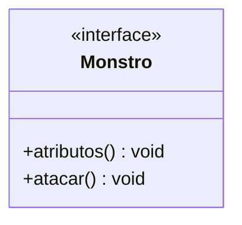
```mermaid
classDiagram
    class Monstro {
        <<interface>>
        +atributos() void
        +atacar() void
}
```

Agora temos a três classes que implementam o modelo criando um monstro de cada tipo:

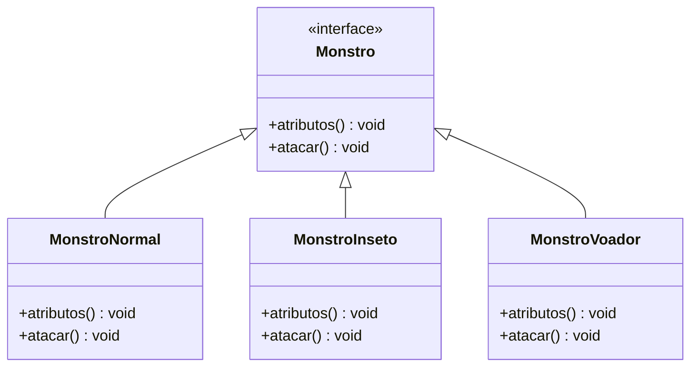
```mermaid
classDiagram
    Monstro <|-- MonstroNormal
    Monstro <|-- MonstroInseto
    Monstro <|-- MonstroVoador
    class Monstro {
        <<interface>>
        +atributos() void
        +atacar() void
    }

    class MonstroNormal {
        +atributos() void
        +atacar() void
    }

    class MonstroInseto {
        +atributos() void
        +atacar() void
    }

    class MonstroVoador {
        +atributos() void
        +atacar() void
    }
```

Agora criamos nossa Factory que possui a lógica de criação dos monstros utilizando como parâmetro o nível que é passado:

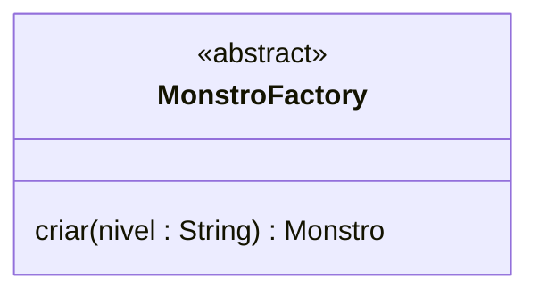
```mermaid
classDiagram
class MonstroFactory {
    <<abstract>>
    criar(nivel : String) Monstro
}
```

Por fim no cliente para criarmos um monstro, basta invovar a Factory e passarmos o nível que queremos, simplificando a criação com uma única linha de comando:

```
    Monstro monstro1 = MonstroFactory.criar("nivel1");
```

No exemplo acima utilizamos uma variação da Factory Method chamada **Simple Factory**, abaixo a implementação em código:

[Exemplo](https://github.com/augustocesarsousa/design-patterns/tree/main/src/main/java/br/com/design_patters/creational/factory_method)

### Abstract Factory Method

O padrão Abstract Factory Method é utilizado quando precisamos criar objetos que pertencem a uma mesma **família** de objetos ou possuem uma relação entre si.

**Exemplo**

Vamos continuar utilizando o exemplo do jogo, mas agora queremos criar um **grupo** de objetos, esse grupo será formado por um **mapa** e um **monstro** relacionado a esse mapa, com isso evitamos a criação de **mapas/monstros** que não possuem relação, exemplo, colocar um monstro do tipo **água** em um mapa de **fogo**, portanto temos abaixo os três modelos:

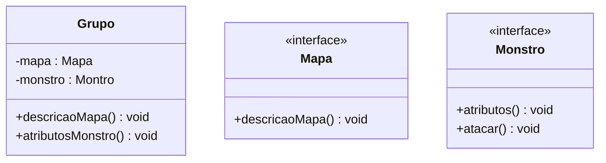
```mermaid
classDiagram
class Grupo {
    -mapa : Mapa
    -monstro : Montro
    +descricaoMapa() void
    +atributosMonstro() void
}

class Mapa {
    <<interface>>
    +descricaoMapa() void
}

class Monstro {
    <<interface>>
    +atributos() void
    +atacar() void
}
```

Agora temos as classes que implementam as interfaces **Mapa** e **Monstro**:

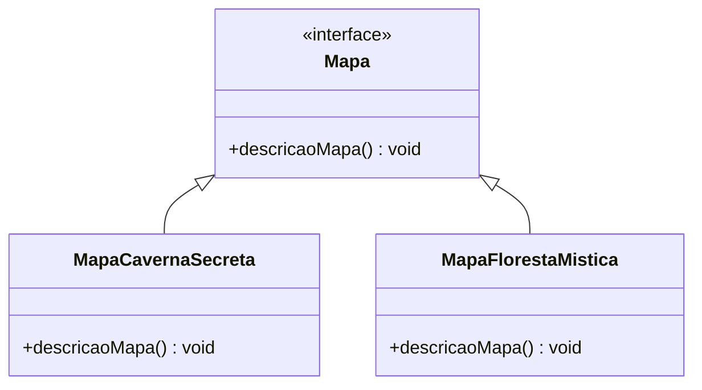
```mermaid
classDiagram
    Mapa <|-- MapaCavernaSecreta
    Mapa <|-- MapaFlorestaMistica
    class Mapa {
        <<interface>>
        +descricaoMapa() void
    }

    class MapaCavernaSecreta {
        +descricaoMapa() void
    }

    class MapaFlorestaMistica {
        +descricaoMapa() void
    }

```

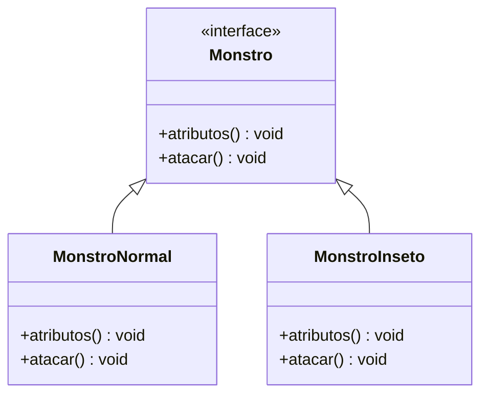
```mermaid
classDiagram
    Monstro <|-- MonstroNormal
    Monstro <|-- MonstroInseto
    class Monstro {
        <<interface>>
        +atributos() void
        +atacar() void
    }

    class MonstroNormal {
        +atributos() void
        +atacar() void
    }

    class MonstroInseto {
        +atributos() void
        +atacar() void
    }

```

Agora temos a Abstract Factory que abstrai toda a lógica de criação dos nossos grupos através do nível informado:

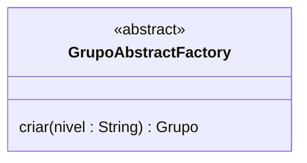
```mermaid
classDiagram
class GrupoAbstractFactory {
    <<abstract>>
    criar(nivel : String) Grupo
}
```

Agora no cliente basta invocarmos a Abstract Factory e passar o nível do grupo que queremos:

```
    Grupo grupoNivel1 = GrupoAbstractFactory.criar("nivel1");
```

Abaixo a implementação em código:

[Exemplo](https://github.com/augustocesarsousa/design-patterns/tree/main/src/main/java/br/com/design_patters/creational/abstract_factory_method)

### Singleton

O padrão Singleton é utilizado quando precisamos criar um objeto **mutável** de instância **única** que é compartilhado globalmente dentro do nosso sistema, assim quando uma alteração é feita nesse objeto ela é observada por todos os objetos que o possuem em sua composição.

Para criarmos um objeto de instância única fazemos com que ele instancie a si mesmo dentro do seu método construtor, depois modificamos o acesso do seu construtor como privado para que ele não possa ser instanciado por outro objeto, por fim criamos um método que possa prover essa instância quando ele é invocado.

**Exemplo**

Agora em nosso jogo queremos criar um objeto **Dia** que será compartilhado pelos mapas, esse objeto irá conter a data e o turno que será um **enum** com os turnos do dia (manhã, tarde e noite), esse objeto terá uma única instância porque não queremos mapas com dias e turnos diferentes, abaixo temos os modelos:

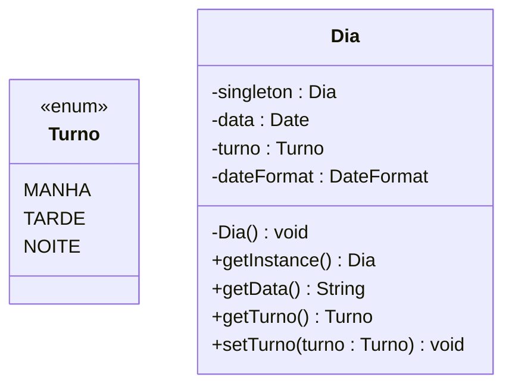
```mermaid
classDiagram
    class Turno {
        <<enum>>
        MANHA
        TARDE
        NOITE
    }

    class Dia {
        -singleton : Dia
        -data : Date
        -turno : Turno
        -dateFormat : DateFormat
        -Dia() void
        +getInstance() Dia
        +getData() String
        +getTurno() Turno
        +setTurno(turno : Turno)void
    }
```

Agora adicionamos o atributo **dia** no nosso modelo de **mapa**:

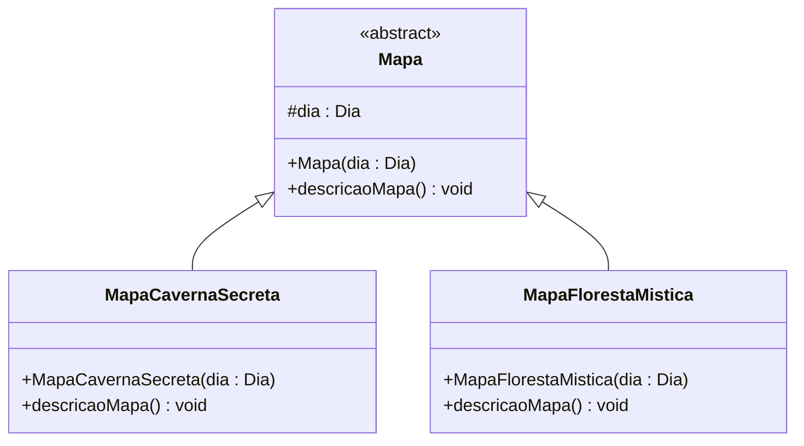
```mermaid
classDiagram
    Mapa <|-- MapaCavernaSecreta
    Mapa <|-- MapaFlorestaMistica
    class Mapa {
        <<abstract>>
        #dia : Dia
        +Mapa(dia : Dia)
        +descricaoMapa() void
    }

    class MapaCavernaSecreta {
        +MapaCavernaSecreta(dia : Dia)
        +descricaoMapa() void
    }

    class MapaFlorestaMistica {
        +MapaFlorestaMistica(dia : Dia)
        +descricaoMapa() void
    }
```

Agora quando quisermos criar nossos mapas passamos a instância do **dia** por parâmetro, assim todos os mapas criados terão os mesmos dados do **dia** e quando uma alteração é feita no **dia** todos os mapas enxergarão essa mudança.

Abaixo a implementação desse padrão em código:

[Exemplo](https://github.com/augustocesarsousa/design-patterns/tree/main/src/main/java/br/com/design_patters/creational/singleton)

### Builder

Utilizamos o padrão Buider quando queremos criar representações diferentes de um mesmo objeto complexo, exemplo, queremos criar um objeto **pessoa** que possui vários atributos, porém, na hora da criação do objeto nem todas as pessoas irão possuir os mesmos atributos, uma pessoa pode ter um e-mail, outra não, uma pessoa pode ter dois números de telefone, outra apenas um, e por aí vai. A forma padrão de criarmos essas representações seria através da sobrecarga do método construtor, porém em objetos com muitos atributos isso se torna inviável, é nesse cenário que o Builder entra.

**Exemplo**

Vamos utilizar como exemplo a criação dos personagens do nosso jogo, o Builder nos dá a opção de definir que alguns atributos sejam obrigatórios, no nosso caso vamos definir o nome e o tipo do personagem como atributos obrigatórios, os outros atributos serão definidos conforme cada tipo de personagem onde o tipo será um enum com as classes (arqueiro, guerreiro ou mago), temos abaixo os modelos:

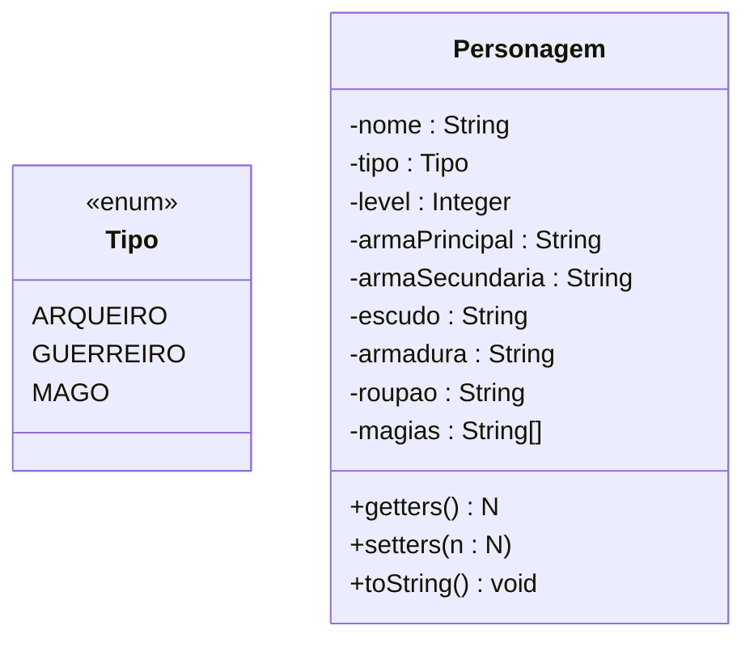
```mermaid
classDiagram
    class Tipo {
        <<enum>>
        ARQUEIRO
        GUERREIRO
        MAGO
    }

    class Personagem {
        -nome : String
        -tipo : Tipo
        -level : Integer
        -armaPrincipal : String
        -armaSecundaria : String
        -escudo : String
        -armadura : String
        -roupao : String
        -magias : String[]
        +getters() N
        +setters(n : N)
        +toString() void
    }
```

Agora criamos nosso Builder que será responsável pela criação dos personagens:

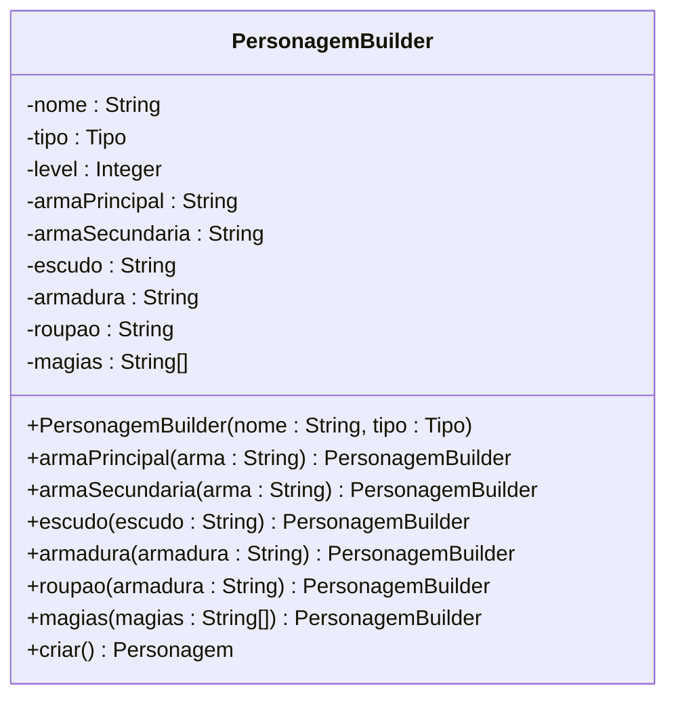
```mermaid
classDiagram
    class PersonagemBuilder {
        -nome : String
        -tipo : Tipo
        -level : Integer
        -armaPrincipal : String
        -armaSecundaria : String
        -escudo : String
        -armadura : String
        -roupao : String
        -magias : String[]
        +PersonagemBuilder(nome : String, tipo : Tipo)
        +armaPrincipal(arma : String) PersonagemBuilder
        +armaSecundaria(arma : String) PersonagemBuilder
        +escudo(escudo : String) PersonagemBuilder
        +armadura(armadura : String) PersonagemBuilder
        +roupao(armadura : String) PersonagemBuilder
        +magias(magias : String[]) PersonagemBuilder
        +criar() Personagem
    }
```

Agora no cliente, para criarmos o personagem chamamos o Builder e informamos os atributos que desejamos:

```
    Personagem personagem = new PersonagemBuilder("Légolas", Tipo.ARQUEIRO)
        .armaPrincipal("Arco Leve")
        .armaSecundaria("Espada Leve")
        .armadura("Armadura Leve")
        .magias(Arrays.asList("Flecha de Vento", "Esgrima Élfica"))
        .criar();
```

No exemplo acima, utilizamos uma variação do Builder chamada **fluent**, abaixo a implementação em código:

[Exemplo](https://github.com/augustocesarsousa/design-patterns/tree/main/src/main/java/br/com/design_patters/creational/builder)

### Prototype

Utilizamos o padrão Prototype quando queremos criar um objeto a partir de um objeto pré-existente onde desejamos alterar algumas características, evitando a criação de um objeto do zero. Praticamente o Prototype é um **clone** do objeto original, o Java já possui uma interface que faz o clone de um objeto, mas caso precisemos podemos alterar o método para cumprir as especificações que desejamos.

**Exemplo**

Agora em nosso jogo queremos criar monstros diferentes dentro da mesma espécie, porém não queremos criar um monstro do zero, então, utilizamos o Prototype para fazer um clone de um monstro já existente e alteramos as características que desejamos, temos o modelo abaixo:

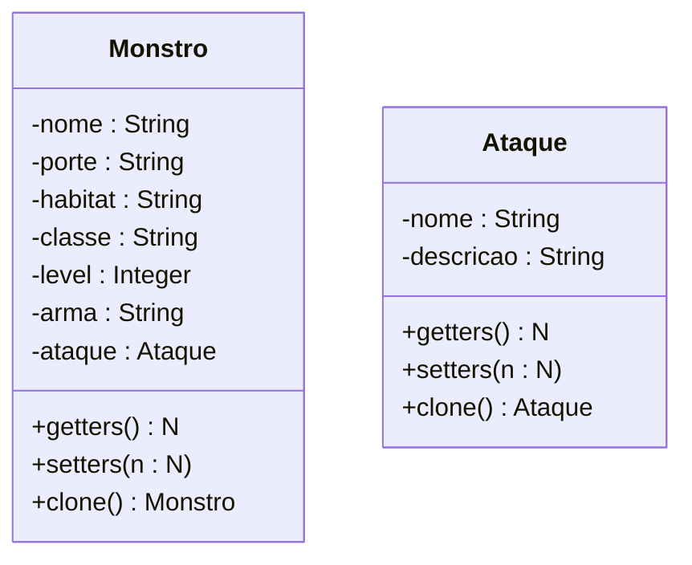
```mermaid
classDiagram
    class Monstro {
        -nome : String
        -porte : String
        -habitat : String
        -classe : String
        -level : Integer
        -arma : String
        -ataque : Ataque
        +getters() N
        +setters(n : N)
        +clone() Monstro
    }

    class Ataque {
        -nome : String
        -descricao : String
        +getters() N
        +setters(n : N)
        +clone() Ataque
    }
```

No cliente criaremos dois monstros onde um será da classe **Soldado** e o outro será um **Chefe**, que foi clonado de um soldado e foram feitas as alterações.

Abaixo, temos a implementação em código:

[Exemplo](https://github.com/augustocesarsousa/design-patterns/tree/main/src/main/java/br/com/design_patters/creational/prototype)

## Padrões de Projetos Estruturais

Os padrões estruturais são utilizados quando precisamos estruturar objetos e classes de forma extensível e flexível.

### Adapter

Utilizamos o padrão Adapter quando precisamos adaptar um objeto ou classe de forma que ele possa se integrar com outros objetos e classes não compatíveis previamente. Usando um exemplo no mundo real, quando utilizamos um adaptador de tomadas onde nossa tomada possiu três pinos, porém o plug da parede possui apenas dois, utilizamos então um adaptador para fazer a tomada de três pinos encaixar no plug de dois.

**Exemplo**

Vamos utilizar como exemplo um computador que possui uma porta HDMI e queremos conectá-lo a uma TV que também possui uma porta HDMI, essa conexão irá funcionar sem problemas e o computador transmitirá vídeo e áudio para a TV, porém agora queremos conectar o mesmo computador só que em um monitor que possui apenas um porta VGA, então utilizamos um adaptador que fará a conexão e irá converter o sinal vindo da porta HDMI do computador para a porta VGA do monitor porém o monitor não irá reproduzir áudio, porque o cabo VGA transmite apenas sinal de vídeo. Vamos representar este senário em forma de objetos.

Primeiro criamos as interfaces HDMI e VGA com seus respectivos métodos:

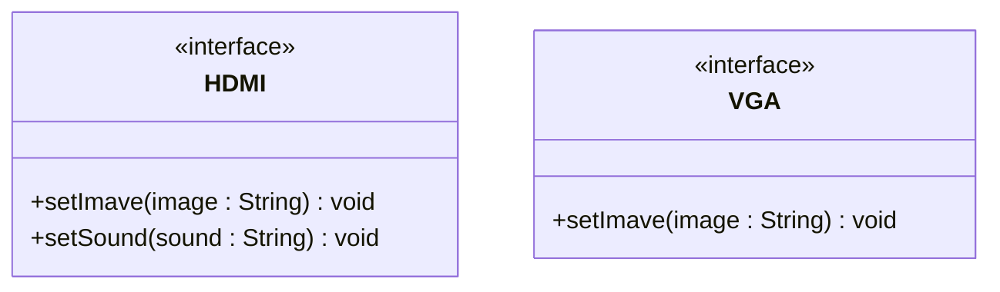
```mermaid
classDiagram
    class HDMI {
        <<interface>>
        +setImave(image : String) void
        +setSound(sound : String) void
    }

    class VGA {
        <<interface>>
        +setImave(image : String) void
    }
```

Agora criamos os dispositivos TV e OldMonitor, que implementam as interfaces:

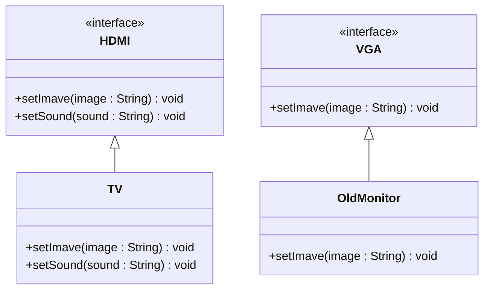
```mermaid
classDiagram
    HDMI <|-- TV
    VGA <|-- OldMonitor
    class HDMI {
        <<interface>>
        +setImave(image : String) void
        +setSound(sound : String) void
    }

    class TV {
        +setImave(image : String) void
        +setSound(sound : String) void
    }
    class VGA {
        <<interface>>
        +setImave(image : String) void
    }

    class OldMonitor {
        +setImave(image : String) void
    }
```

Agora criamos nosso computador com uma porta HDMI:

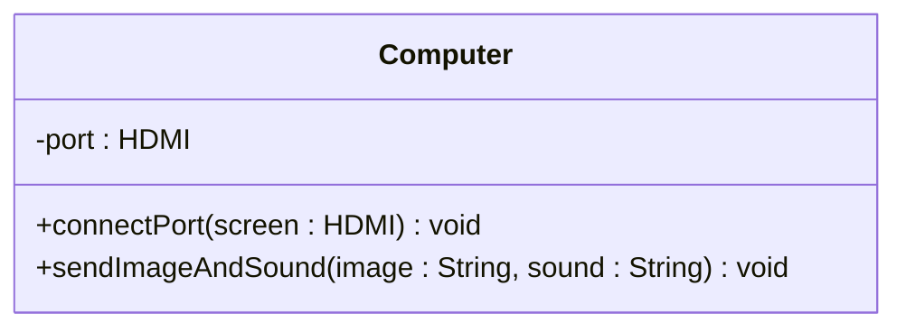
```mermaid
classDiagram
    class Computer {
        -port : HDMI
        +connectPort(screen : HDMI) void
        +sendImageAndSound(image : String, sound : String) void
    }
```

Agora criamos o nosso adaptador que implementa a interface HDMI fará a conexão da porta HDMI do computador para a porta VGA do monitor:

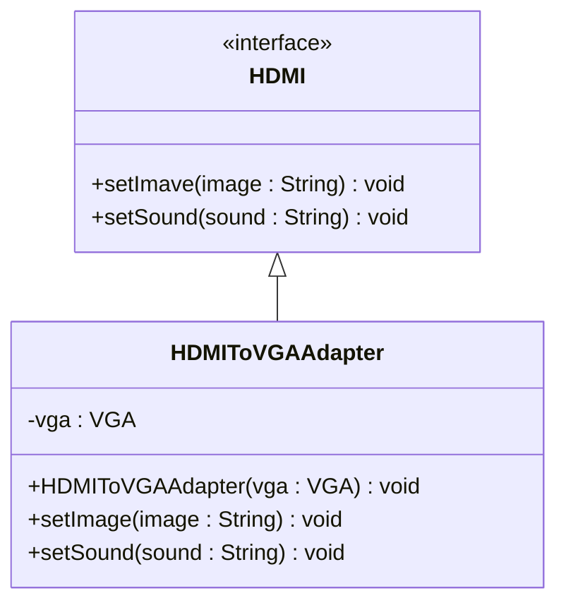
```mermaid
classDiagram
    HDMI <|-- HDMIToVGAAdapter
    class HDMI {
        <<interface>>
        +setImave(image : String) void
        +setSound(sound : String) void
    }

    class HDMIToVGAAdapter {
        -vga : VGA
        +HDMIToVGAAdapter(vga : VGA) void
        +setImage(image : String) void
        +setSound(sound : String) void
    }
```

Por fim no nosso cliente instanciamos nosso objetos e fazemos as conexões:

```
    System.out.println("Computer with TV");
    Computer computer = new Computer();
    TV tv = new TV();
    computer.connectPort(tv);
    computer.sendImageAndSound("Trailer Avengers", "Sound theme");

    System.out.println("Computer with Old monitor");
    Computer computer2 = new Computer();
    OldMonitor oldMonitor = new OldMonitor();
    computer2.connectPort(new HDMIToVGAAdapter(oldMonitor));
    computer2.sendImageAndSound("Trailer Justice League", "Sound theme");
```

Abaixo temos a implementação do código:

[Exemplo](https://github.com/augustocesarsousa/design-patterns/tree/main/src/main/java/br/com/design_patters/structural/adapter)

### Bridge

Utilizamos o padrão Bridge quando precisamos que a abstração e a implementação possam variar independentemente em tempo de execução.

**Exemplo**

Temos um sistema de cadastro de funcionários e queremos encaminhar os dados para outros dois sistemas, um sistema lê dados em formato CSV e o outro lê dados em formato JSON, utilizamos o padrão Bridge para criarmos essa "ponte" entre os dados e os sistemas fazendo que as informações possam ser convertidas da forma que desejamos, no diagrama abaixo temos:

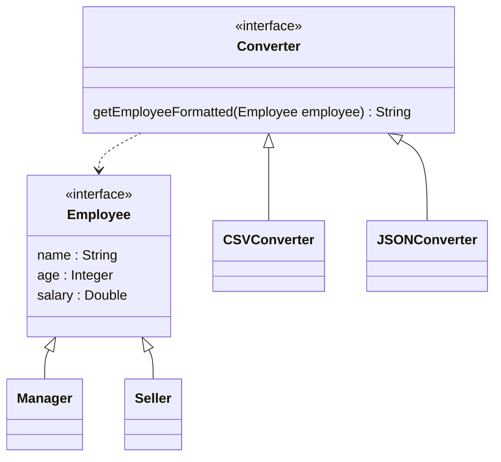
```mermaid
classDiagram
    Employee <|-- Manager
    Employee <|-- Seller
    Converter <|-- CSVConverter
    Converter <|-- JSONConverter
    Converter ..> Employee
    class Employee {
        <<interface>>
        name : String
        age : Integer
        salary : Double
    }

    class Seller {
    }

    class Manager {
    }

    class Converter {
        <<interface>>
        getEmployeeFormatted(Employee employee) String
    }

    class CSVConverter {
    }

    class JSONConverter {
    }
```

Analisando o diagrama, nós temos a abstração **Employee** que define um funcionário representado por uma **interface** e duas implementações, **Manager** e **Seller**, depois temos a abstração **Converter** com o método **getEmployeeFormatted** que define a formatação do **Employee** informado, e duas implementações, **CSVConverter** que irá converter o **Employee** para CSV e **JSONConverter** que irá converter o **Employee** para JSON. Desta forma podemos converter o mesmo Employee tanto para CSV quanto para JSON em tempo de execução e não precisando criar uma implementação para cada tipo de Employee.

Abaixo temos a implementação em código:

[Exemplo](https://github.com/augustocesarsousa/design-patterns/tree/main/src/main/java/br/com/design_patters/structural/bridge)

### Composite

Utilizamos o padrão Composite quando queremos que um objeto ou um conjunto deles possam ser tratados de forma transparente, sem diferenças. Para isso definimos uma composição que contenha tanto um único objeto quanto um conjunto dos mesmos elementos, representando estruturas hierárquicas.

**Exemplo**

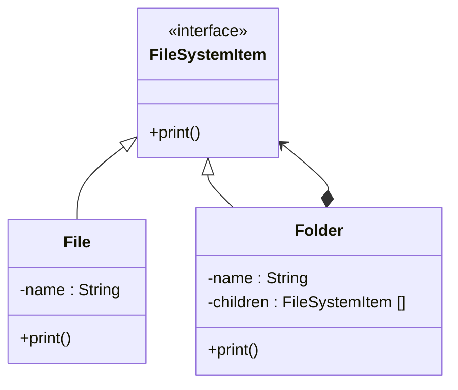
```mermaid
classDiagram
    FileSystemItem <|-- File
    FileSystemItem <|-- Folder
    FileSystemItem <--* Folder
    class FileSystemItem {
        <<interface>>
        +print()
    }

    class File {
        -name : String
        +print()
    }

    class Folder {
        -name : String
        -children : FileSystemItem []
        +print()
    }
```

Analisando o diagrama acima temos dois objetos distintos, **File** que representa uma **parte** e o **Folder** que representa um **todo**, agora pra tratarmos esses objetos da mesma forma temos um interface **FileSystemItem** onde tanto o **File** quanto o **Folder** implementam essa interface, notamos também que dentro do Folder temos um atributo **children** que é uma lista de FIleSystemItem, ou seja, dentro do Folder podemos ter outros Folders ou Files representando assim uma recursividade.

Abaixo temos a representação em código:

[Exemplo](https://github.com/augustocesarsousa/design-patterns/tree/main/src/main/java/br/com/design_patters/structural/composite)

### Decorator

Utilizamos o padrão Decorator quando queremos adicionar funcionalidades dinamicamente em um objeto.

**Exemplo**

Vamos utilizar como exemplo a criação de bebidas onde temos a **interface** **Drink** que fornece o modelo da bebida, depois temos duas bebidas **Coffee** e **Tea** que implementam a interface Drink. Agora queremos adicionar um pouco de leite ao nosso café criando então um **CoffeWithMilk**, poderíamos criar um nova classe que estenderia a classe Coffee, mas supondo que temos **N** combinações para nosso café, seria necessário criar uma classe para cada nova funcionalidade, o padrão **Decorator** serve para nos auxiliar nesses tipos de situações onde nós "decoramos" a classe que queremos e adicionamos a nova funcionalidade, vamos analisar o diagrama abaixo:

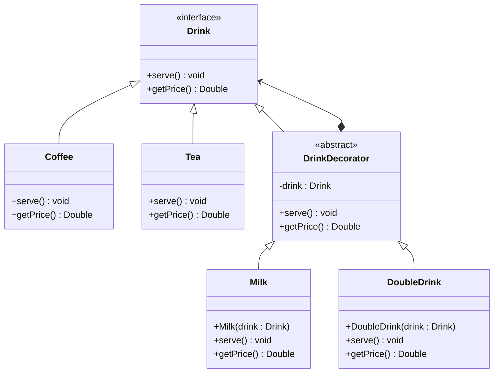
```mermaid
classDiagram
    Drink <|-- Coffee
    Drink <|-- Tea
    Drink <|-- DrinkDecorator
    Drink <--* DrinkDecorator
    DrinkDecorator <|-- Milk
    DrinkDecorator <|-- DoubleDrink
    class Drink {
        <<interface>>
        +serve() void
        +getPrice() Double
    }

    class Coffee {
        +serve() void
        +getPrice() Double
    }

    class Tea {
        +serve() void
        +getPrice() Double
    }

    class DrinkDecorator {
        <<abstract>>
        -drink : Drink
        +serve() void
        +getPrice() Double
    }

    class Milk {
        +Milk(drink : Drink)
        +serve() void
        +getPrice() Double
    }

    class DoubleDrink {
        +DoubleDrink(drink : Drink)
        +serve() void
        +getPrice() Double
    }
```

Conforme o diagrama, temos a interface **Drink** e as classes concretas **Coffee** e **Tea** que implementam a interface, temos também a classe abstrata **DrinkDecorator** que adiciona uma funcionalidade as classes concretas, por fim criamos duas funcionalidades **Milk** que adiciona leite a nossa bebida e **DoubleDrink** que dobra a quantidade da nossa bebida.

Abaixo temos a implementação em código:

[Exemplo](https://github.com/augustocesarsousa/design-patterns/tree/main/src/main/java/br/com/design_patters/structural/decorator)

### Facade

Utilizamos o padrão Facade quando queremos simplificar o acesso a serviços de um sistema complexo.

**Exemplo**

Vamos utilizar como exemplo um sistema bancário onde o cliente precisa ter acesso a alguns serviços do cartão de crédito, mas não podemos nossas entidades ao cliente, criamos então uma interface de acesso, abstraindo apenas as informações relevantes para os serviços solicitados, vamos analisar o diagrama abaixo:

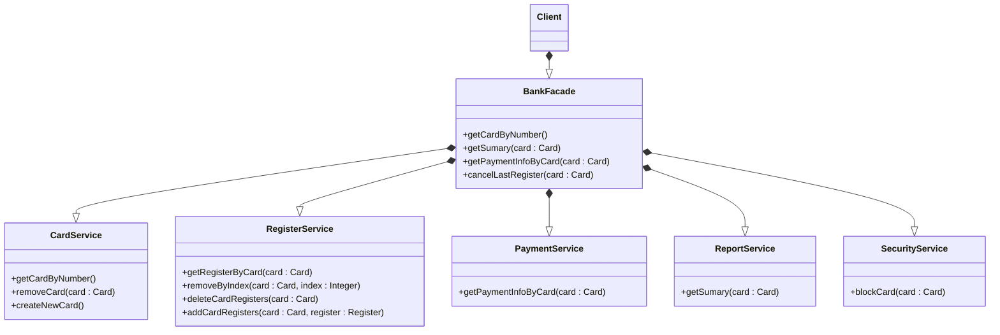
```mermaid
classDiagram
    Client *--|> BankFacade
    BankFacade *--|> CardService
    BankFacade *--|> RegisterService
    BankFacade *--|> PaymentService
    BankFacade *--|> ReportService
    BankFacade *--|> SecurityService
    class BankFacade {
        +getCardByNumber()
        +getSumary(card : Card)
        +getPaymentInfoByCard(card : Card)
        +cancelLastRegister(card : Card)
    }
    class CardService {
        +getCardByNumber()
        +removeCard(card : Card)
        +createNewCard()
    }
    class RegisterService {
        +getRegisterByCard(card : Card)
        +removeByIndex(card : Card, index : Integer)
        +deleteCardRegisters(card : Card)
        +addCardRegisters(card : Card, register : Register)
    }
    class PaymentService {
        +getPaymentInfoByCard(card : Card)
    }
    class ReportService {
        +getSumary(card : Card)
    }
    class SecurityService {
        +blockCard(card : Card)
    }
```

No diagrama acima o cliente acessa a **BankFacade** que representa nossa interface de acesso aos serviços, dessa forma podemos simplificar e abstrair apenas o necessário para executar as operações, livrando o cliente da complexidade, diminuindo o acoplamento, aumentando o encapsulamento e a segurança do nosso sistema.

Abaixo temos a implementação em código:

[Exemplo](https://github.com/augustocesarsousa/design-patterns/tree/main/src/main/java/br/com/design_patters/structural/facade)

### Flyweight

Utilizamos o parão Flywaight quando queremos trabalhar com muitos objetos em memória de forma mais eficiente, com ele geramos uma espécie de **cache** onde armazenamos uma instância única com atributos intrínsecos de um objeto e ao chamarmos essa instância adicionamos os outros atributos extrínsecos.

**Exemplo**

Vamos utilizar como exemplo um streaming de música onde uma música possui valores intrínsecos (nome, autor, duração) e valores extrínsecos (quantidade de vezes que a música foi tocada), os valores intrínsecos podemos armazenar uma instância única em memória para todos os usuários e os valores extrínsecos nós inserimos para cada usuário.

Vamos analisar o diagrama abaixo:

```mermaid
classDiagram
    Client --|> MusicService
    MusicService *--|> Music
    MusicService --|> FlyweightFactory
    MusicService --|> MusicFlyweight
    Music *--|> MusicFlyweight
    FlyweightFactory *--|> FlyweightFactory
    FlyweightFactory *--|> MusicFlyweight
    class MusicService {
        -memory
        +listenMusic()
        +report()
    }

    class Music {
        -musicFlyweight
        -playerCount
    }

    class FlyweightFactory {
        -repository : MusicFlyweight[]
        -instance : FlyweightFactory
        +getInstance() FlyweightFactory
        +getMusic() MusicFlyweight
    }

    class MusicFlyweight {
        -name
        -artist
        -duration
    }
```

No diagrama acima, temos o **Client** que acessa o **MusicService** que é resposável por devolver uma música quando solicitado, temos um **FlyweightFactory** que é responsável por criar uma instância do **Flyweight** por música, temos o **MusicFlyweight** com os valores intrínsecos e o **Music** que possui os valores extrínsecos que muda a cada vez em que a música é tocada.

Abaixo temos a implementação e código:

[Exemplo](https://github.com/augustocesarsousa/design-patterns/tree/main/src/main/java/br/com/design_patters/structural/flyweight)

### Mediator

Utilizamos o padrão Mediator quando precisamos reduzir o acoplamento entre objetos que precisam se comunicar, tornando a comunicação mais dinâmica. O Mediator funciona como um "garoto de recados" onde os objetos não precisam se conhecer, basta enviar a mensagem para o Mediator que ele irá entrega-la para o destinatário.

**Exemplo**

Vamos utilizar como exemplo um chat, onde os usuários não se conhecem diretamente, para isso utilizamos um Mediator que recebe a mensagem e a entrega para o destinatário, podemos ter Mediator específicos para funções diferentes, como um Mediator apenas que envia a mensagem e outro que antes de enviar faz a tradução para a língua nativa do destinatário.

Vamos analisar o diagrama abaixo:

```mermaid
classDiagram
    Mediator <|-- TranslateMediator
    Mediator <|-- ChatMediator
    Mediator <|--* User
    ChatMediator *--|> User
    TranslateMediator *--|> User
    User <|-- EnglishUser
    User <|-- ProtugueseUser
    class Mediator {
        <<abstract>>
        +addUser()
        +removeUser()
        +sendMessage(message, to, from)
    }
    class ChatMediator {
        +addUser()
        +removeUser()
        +sendMessage(message, to, from)
    }
    class TranslateMediator {
        +addUser()
        +removeUser()
        +sendMessage(message, to, from)
    }
    class User {
        <<abstract>>
        -name
        -language
        -mediator : Mediator
        +User(name, mediator)
        +sendMessage(message, to)
        receivedMessage(from, message)
    }

```

Temos então o nosso Mediator e duas variações, ChatMediator e TranslateMediator que são responsáveis por mandar e traduzir as mensagens, e temos o objeto User e suas variações EnglishUser e PortugueseUser, um para cada idioma, dessa forma, caso seja preciso adicionar novos idiomas basta criar outra variação.

Abaixo a implementação em código:

[Exemplo](https://github.com/augustocesarsousa/design-patterns/tree/main/src/main/java/br/com/design_patters/structural/mediator)

### Proxy

Utilizamos o padrão Proxy, quando queremos controlar o acesso a algum objeto, podendo modificar e ou adicionar funcionalidades.

**Exemplo**

Vamos utilizar como exemplo um sistema simplificado de um banco, onde o cliente pode acessar o objeto **Banco** e executar suas operação e também pode acessar o objeto **Caixa Eletrônico** e executar suas operações porém com algumas restrições é nesse ponto onde inserimos o Proxy.

Vamos analisar o diagrama abaixo:

```mermaid
classDiagram
    Client ..> BankOperations
    Client ..> Bank
    Client ..> ATM
    BankOperations <|-- Bank
    BankOperations <|-- ATM
    BankOperations <|--* ATM
    class BankOperations {
        <<interface>>
        +deposit()
        +withdraw()
        +changePassword()
    }
    class Bank {
        +deposit()
        +withdraw()
        +changePassword()
    }
    class ATM {
        -bank : BankOperations
        +ATM(bank)
        +deposit()
        +withdraw()
        +changePassword()
    }
```

Temos então nosso Client que pode acessar o Bank e o ATM para executar sua operações, os objetos Bank e ATM implementam a interface BankOperations que define as operações que serão realizadas, porém o ATM possuem a implementação de um Proxy que faz um contro nas operações definindo certas limitações.

Abaixo temos a implementação em código:

[Exemplo](https://github.com/augustocesarsousa/design-patterns/tree/main/src/main/java/br/com/design_patters/structural/proxy)

## Padrões de Projetos Comportamentais

Os Padrões de Projetos Comportamentais são utilizados quando queremos definir como as responsabilidades são programadas, como os objetos se comunicam a fim de reforçar princípios da Orientação a Objeto como o baixo acoplamento.

### Chain of Responsibility

O primeiro padrão que abordaremos nesse tópico é o Chain of Responsibility, esse padrão é utilizados quando queremos evitar o acoplamento entre o remetente de uma solicitação e seu receptor, podem fazer com que mais de um objeto possa atender a mesma requisição. Esse padrão usa com princípio uma "corrente" onde cada objeto chamada executa uma tarefa e chama e próximo caso seja necessário.

**Exemplo**

Vamos usar como exemplo um caixa eletrônico onde informamos o valor do saque que queremos fazer e o processamento dentro do caixa irá analisar as notas disponíveis e retornará as quantidades necessárias. De uma forma mais simples podemos fazer esse processamento utilizando uma cadeia de **IFs** e **Elses** para analisar os valores das notas, porém dessa forma todas as nossas validações estaria embutidas dentro de uma mesma classe agregando um alto acoplamento em nosso sistema, aplicando o Chain of Resposibility podemos dividir as tarefas em outros objetos onde cada um será responsável por analisar um valor de nota, executar uma ação e caso necessário, chamar o próximo objeto.

Vamos analisar o diagrama abaixo:

```mermaid
classDiagram
    Dispenser *--|> Bill
    Bill *--|> Bill
    Bill <.. BillOf1Instance
    Bill <.. BillOf10Instance
    Bill <.. BillOf20Instance
    Bill <.. BillOf50Instance
    Bill <.. BillOf100Instance
    class Dispenser {
        -chain : Bill
        +withdraw(value)
    }
    class Bill {
        -value : Integer
        -next : Bill
        +execute()
    }
```

Analisando o diagrama acima temos o objeto **Bill** que representa uma nota com seu valor e o link para a próxima nota que deve ser chamada, temos abaixo as instâncias de notas com valores diferentes e por fim o **Dispenser** que é responsável por montar essa cadeia de notas e implementar o método de saque.

No link abaixo temos a implementação em código:

[Exemplo](https://github.com/augustocesarsousa/design-patterns/tree/main/src/main/java/br/com/design_patters/behavioral/chainOfResponsibility)

### Memento

Utilizamos o padrão Memento quando queremos capturar o estado de um objeto para podermos restaurá-lo posteriormente, podendo criar uma lista de estados que podem ser acessados independentemente.

**Exemplo**

Vamos utilizar como exemplo um campo de texto onde podemos salvar os estados dos textos digitados e posteriormente podemos voltar a estes estados assim como funciona em um editor de texto com os comandos **Ctrl+Z** para voltar e **Ctrl+Shift+Z** para avançar.

Vamos analisar o diagrama abaixo:

```mermaid
classDiagram
    Client ..> Caretaker
    Client ..> JTextAreaWithMemory
    Caretaker *--|> Memento
    JTextAreaWithMemory *--|> JTextAreaMemento
    JTextAreaMemento --|> Memento
    class Caretaker {
        -mementos : Memento[]
        +add(Memento)
        +get(index) Memento
    }
    class JTextAreaWithMemory {
        <<Originator>>
        +save(Memento)
        +restore(Memento)
    }
    class JTextAreaMemento {
        -state
    }
    class JTextAreaMemento {
        <<Interface>>
    }
```

Analisando o diagrama acima, temos a classe **Client** que acessa a classe **Caretaker** que é responsável por gerar a lista de mementos, temos a classe **JTextAreaWithMemory** que possui os métodos responsáveis por salvar e retornar os estados, temos a classe **JTextAreaMemento** que encapsula o estado de um TextArea, e por fim temos a interface **Memento**.

No link abaixo temos a implementação em código:

[Exemplo](https://github.com/augustocesarsousa/design-patterns/tree/main/src/main/java/br/com/design_patters/behavioral/memento)

### Command

Utilizamos o padrão Command quando queremos que nossa aplicação possa executar uma tarefa e também possa desfazê-lá, diferente do padrão **Memento** o Command não possui uma lista de estados, mas ele permite que o cliente possa parametrizar diferentes requisições, filas ou requisições de logs e suporta a reversão dessas tarefas.

**Exemplo**

Vamos utilizar como exemplo uma **Alexa** que possui os comandos ligar e desligar as luzes de um aparelho, utilizando o padrão Command criamos as duas classes TurnLightOnCommand e TurnLightOffCommand que são responsáveis por executar o e desfazer o comando ligar/desligar, depois criamos a interface GenericLight onde os aparelhos que desejam se integrar com a Alexa precisam implementá-la.

Vamos analisar como ficaria no exemplo abaixo:

```mermaid
classDiagram
    Alexa *..> Command
    Command <|-- TurnLightOnCommand
    Command <|-- TurnLightOffCommand
    TurnLightOnCommand *..> GenericLight
    TurnLightOffCommand *..> GenericLight
    GenericLight <|-- PhilipsHueLight
    GenericLight <|-- XiaomiLight
    class Alexa {
        -integration
        +setRequest()
    }
    class Command {
        <<Interface>>
        +execute()
    }
    class TurnLightOnCommand {
        -light : GenericLight
        +TurnLightOnCommand(light)
        +execute()
    }
    class TurnLightOffCommand {
        -light : GenericLight
        +TurnLightOffCommand(light)
        +execute()
    }
    class GenericLight {
        <<Interface>>
        +turnOn()
        +turnOff()
    }
    class PhilipsHueLight {
        +turnOn()
        +turnOff()
    }
    class XiaomiLight {
        +turnOn()
        +turnOff()
    }
```

No link abaixo temos a implementação em código:

[Exemplo](https://github.com/augustocesarsousa/design-patterns/tree/main/src/main/java/br/com/design_patters/behavioral/command)

### Iterator

Utilizamos o padrão Iterator quando queremos percorrer uma coleção de objetos sem a necessidade de conhecer os detalhes desta estrutura.

**Exemplo**

Vamos utilizar como exemplo uma TV que possui uma lista de canais, mas nós não sabemos quais canais estão nesta lista, o Java já possui o padrão Iterator nativo na linguagem definimos então uma classe que implementa esse padrão e será a responsável por executar a iteração na lista de canais.

Vamos analisar o diagrama abaixo:

```mermaid
    classDiagram
    Iterable <|-- TV
    Iterable ..> Iterator
    TV ..> Iterator
    TV ..> ChannelIterator
    ChannelIterator --|> Iterator
    class Iterable {
        <<Interface>>
        +iterator() Iterator
    }
    class TV {
        -channels
        +iterator() Iterator
        +searchAvaiableChannels()
    }
    class Iterator {
        +hasNext()
        +next()
    }
    class ChannelIterator {
        -channels
        -index
        +ChannelIterator(channels)
        +hasNext()
        +next()
    }
```

Temos então a interface Iterable que possui o método iterator e a classe que deseja utilizá-la precisa implementá-lo, no nosso caso é a classe TV onde iremos iterar sobre os seus canais, temos também a classe ChannelIterator que implementa a interface Iterator com os métodos hasNext e next e que responsável por fazer a iteração.

No link abaixo temos a implementação em código:

[Exemplo](https://github.com/augustocesarsousa/design-patterns/tree/main/src/main/java/br/com/design_patters/behavioral/iterator)

### Observer

Utilizamos o padrão Observer quando queremos manter um relacionamento 1-N entre objetos sem que eles fiquem acoplados, e que um objeto possa notificar outros quando necessário.

**Exemplo**

Vamos imaginas um cenário de uma festa surpresa onde a esposa e os amigos de uma pessoa estão o esperando em casa. Temos dois cenários possíveis, o primeiro onde a esposa fica ligando para o porteiro perguntando de o marido já chegou, nesse cenário temos um alto acoplamento entre os objetos onde a esposa ficará o tempo todo ligando para o porteiro esperando uma resposta verdadeira, o outro cenário seria a esposa informar ao porteiro que deseja ser notificada quando o marido chegar, dessa forma temos um acoplamento baixo onde a esposa pode continuar executando outras tarefas enquanto aguarda pela resposta e assim que houver uma resposta porteiro irá notificar todos os interessados.

Vamos analisar o diagrama abaixo:

```mermaid
    classDiagram
    Subject <|-- Doorman
    Subject *--|> Observer
    Observer <|-- Wife
    Observer <|-- Friend
    Wife *--> Doorman
    Friend *--> Doorman
    class Subject {
        -observers : List<Observer>
        +attach(Observer)
        +notifyObservers()
    }
    class Observer {
        <<Interface>>
        +update()
    }
    class Wife {
        -doorman
        +update()
        +partyTime()
    }
    class Friend {
        -doorman
        +update()
        +sendGift()
    }
    class Doorman {
        -status
        +getStatus()
    }
```

Temos então a classe Subject que é responsável por adicionar na lista quem deseja ser notificado e também por notificar todos os interessados, depois temos as classes Wife e Friend que implementam a interface Observer e possuem o método update para serem notificados, por fim temos a classe Doorman que estende o Subject e é capaz de identificar a mudança do evento.

No link abaixo temos a implementação em código:

[Exemplo](https://github.com/augustocesarsousa/design-patterns/tree/main/src/main/java/br/com/design_patters/behavioral/observer)

### State

Utilizamos o padrão State quando queremos alterar o comportamento de um objeto quando o seu estado mudar, permitindo que novos comportamentos sejam adicionados e integrados com os demais. Para isso modelamos os comportamentos possíveis através de States, definimos como serão realizadas as mudanças de estados e cada State irá tomar controle da execução de acordo com o estado interno do objeto aparentando como se o objeto tivesse mudado de classe.

**Exemplo**

Vamos utilizar como exemplo um fone bluetooth, nesse caso o objeto possui três estados, desligado, ligado e tocando música, ele também possui dois tipos de ação, primeiro um toque longo que muda do estado desligado para ligado ou ligado para desligado e o segundo um toque rápido que muda do estado ligado para tocando música. Temos que reforçar que alguns estados não podem mudar para outros de forma direta, exemplo, o fone não pode ir do estado desligado para tocando música diretamente, primeiro ele precisa passar pelo estado ligado antes, por isso é importante definir como serão feitas as mudanças.

Vamos analisar o diagrama abaixo:

```mermaid
    classDiagram
    Client --> Headphone
    Headphone *--|> HeadphoneState
    HeadphoneState <|-- OnState
    HeadphoneState <|-- OffState
    HeadphoneState <|-- PlayingState
    class Client {
    }
    class Headphone {
        -state : HeadphoneState
        -isOn
        -isPlaying
        +onClick()
        +onLongClick()
        +setState(state)
    }
    class HeadphoneState {
        <<Interface>>
        +click(Headphone)
        +longClick(Headphone)
    }
    class OnState {
        -instance
        +getInstance()
        +click(Headphone)
        +longClick(Headphone)
    }
    class OffState {
        -instance
        +getInstance()
        +click(Headphone)
        +longClick(Headphone)
    }
    class PlayingState {
        -instance
        +getInstance()
        +click(Headphone)
        +longClick(Headphone)
    }
```

Temos então o nosso Cliente que acessa a classe Headphone que contém os estados do fone, temos a interface HeadphoneState que contém os métodos de click e longClick e por fim os estados que implementam a interface e possuem a definição das mudanças.

No link abaixo temos a implementação em código:

[Exemplo](https://github.com/augustocesarsousa/design-patterns/tree/main/src/main/java/br/com/design_patters/behavioral/state)

### Strategy

Utilizamos o padrão Strategy quando queremos que uma classe possa utilizar um algoritmo definido dinamicamente, podendo selecionar e trocar a lógica em tempo de execução.

**Exemplo**

Vamos imaginar o seguinte cenário, onde temos o objeto Trabalhador e ele possui três métodos, trabalhar, comer e mover, cada trabalhador pode executar esses métodos de formas diferentes, para isso poderíamos criar N variações para os métodos dentro da própria classe Trabalhador, mas ao utilizar Strategy podemos encapsular essas variações em lógicas separadas de forma mais simples tornando o sistema mais manutenível.

Vamos analisar o diagrama abaixo:

```mermaid
    classDiagram
    Worker <|-- Developer
    Worker <|-- HipsterDeveloper
    Worker <|-- Pilot
    Developer ..> MeatFootStrategy
    Developer ..> DeveloperStrategy
    Developer ..> CarStrategy
    HipsterDeveloper ..> VeggieFootStrategy
    HipsterDeveloper ..> DeveloperStrategy
    HipsterDeveloper ..> BikeStrategy
    Pilot ..> MeatFootStrategy
    Pilot ..> PilotStrategy
    Pilot ..> AirplaneStrategy
    EatStrategy <-- MeatFootStrategy
    EatStrategy <-- VeggieFootStrategy
    TransportationStrategy <-- CarStrategy
    TransportationStrategy <-- BikeStrategy
    TransportationStrategy <-- AirplaneStrategy
    WorkStrategy <-- DeveloperStrategy
    WorkStrategy <-- PilotStrategy
    class Worker {
        <<Interface>>
        +work()
        +eat()
        +move()
    }
    class Developer {
        +work()
        +eat()
        +move()
    }
    class HipsterDeveloper {
        +work()
        +eat()
        +move()
    }
    class Pilot {
        +work()
        +eat()
        +move()
    }
    class EatStrategy {
        <<Interface>>
        +eat()
    }
    class MeatFootStrategy {
        +eat()
    }
    class VeggieFootStrategy {
        +eat()
    }
    class TransportationStrategy {
        <<Interface>>
        +move()
    }
    class BikeStrategy {
        +move()
    }
    class CarStrategy {
        +move()
    }
    class AirplaneStrategy {
        +move()
    }
    class WorkStrategy {
        <<Interface>>
        +work()
    }
    class DeveloperStrategy {
        +work()
    }
    class PilotStrategy {
        +work()
    }
```

Temos então a interface Worker que define os métodos de um trabalhador, temos as implementas do Worker, Developer, HipsterDeveloper e Pilot, onde cada um pode executar os métodos de formas diferentes, para isso criamos uma interface Strategy para cada métodos para que possamos criar as N implementações que desejamos.

No link abaixo temos a implementação em código:

[Exemplo](https://github.com/augustocesarsousa/design-patterns/tree/main/src/main/java/br/com/design_patters/behavioral/strategy)

### Template Method

Utilizamos o padrão Template Method quando queremos unir partes de um código que não variam com partes variáveis, podendo alterar certos pontos do código mantendo uma estrutura geral. Definimos então uma abstração com todos os pontos que podem ser variados e criamos um template que contenha as partes fixas e possua pontos de chamadas para as partes variáveis.

**Exemplo**

Vamos usar como exemplo uma loja que aplica descontos personalizados para seus clientes, exemplo, clientes especiais possuem uma categoria de desconto, porém em época de Black Friday os descontos são maiores que aqueles aplicados para os clientes especiais, temos então um serviço que irá aplicar o melhor desconto no carrinho do cliente dependendo do tipo de cliente e da época do ano, a lógica de verificação será delegada à um template que já irá possuir a estrutura básica de como executar a tarefa, porém os pontos de podem ser personalizados serão implementados pelas classes concretas.

Vamos analisar o diagrama abaixo:

```mermaid
    classDiagram
    BestOfferService --> Cart
    Cart *--> Buyer
    Cart *--> Product
    BestOfferService *--> BestOfferTemplate
    BestOfferTemplate <|-- RegularPrice
    BestOfferTemplate <|-- BlackFriday
    BestOfferTemplate <|-- CategoryDiscounts
    BestOfferTemplate <|-- SpecialClient
    class BestOfferService {
        -templates : BestOfferTemplate[]
        +calculateBestOffer(Cart)
    }
    class Cart {
        -buyer
        -items
    }
    class Buyer {
        -name
        -distance
        -isSpecial
    }
    class Product {
        -desc
        -value
        -weight
        -category
    }
    class BestOfferTemplate {
        <<Abstract>>
        -cart
        -regularItensPrice
        -deliveryTax
        -priceFactor
        -deliveryFactor
        #calculateDeliveryTax()
        #calculateRegularItemPrice()
        #calculateOffer()
        +isReleAppliable()
        #calibrateVariables()
    }
    class RegularPrice {
        +isReleAppliable()
        #calibrateVariables()
    }
    class BlackFriday {
        +isReleAppliable()
        #calibrateVariables()
    }
    class CategoryDiscounts {
        -discountByCategory
        +isReleAppliable()
        #calibrateVariables()
    }
    class SpecialClient {
        +isReleAppliable()
        #calibrateVariables()
    }
```

Temos então o serviço BestOfferService que acessa o carrinho de compras do cliente, temos a abstração da lógica de calcular o melhor desconto no template BestOfferTemplate e por fim as classes concretas que implementam as variações de descontos que podem ser aplicados.

No link abaixo temos a implementação em código:

[Exemplo](https://github.com/augustocesarsousa/design-patterns/tree/main/src/main/java/br/com/design_patters/behavioral/template)