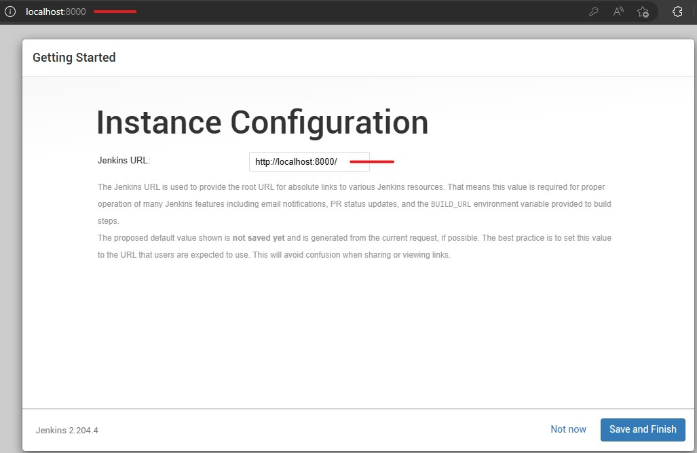

# Jenkins

Jenkins é um servidor que auxilia na construção de processos de Integração Contínua.

## Site oficial

[https://www.jenkins.io/](https://www.jenkins.io/)

**Observação:**

Procedimentos realizados na versão 2.375.1 no Ubuntu na versão 20.04.

## Requisitos

- Java (Nesse tutorial utilizamos a versão 11.0.17-zulu).
- Maven (Nesse tutorial utilizamos a versão 3.6.3).

## Instalação

Baixar o arquivo **.war** no seu diretório de preferência com o comando abaixo:

`wget https://get.jenkins.io/war-stable/2.375.1/jenkins.war`

## Executando

Executar o comando abaixo, caso queira mudar a porta padrão **8080**, pode-se utilizar a tag **--httpPort=porta desejada**:

`java -jar jenkins.war --httpPort=8000`

## Configuração inicial

Ao iniciar pela primeira vez o Jenkins irá solicitar um password e irá indicar o caminho do arquivo que contém a senha conforme imagem abaixo:

Depois clicamos em **Install suggested plugins** para instalar todos os plugins sugeridos:

Após instalados os plugins ele pedirá para criar um usuário:

Depois mantemos a mesma URL e clicamos em **Save and Finish**:

Após instalados os plugins e criado o usuário, devemos informar o caminho das JDKs Java e Maven, para isso acessamos o menu Gerenciar Jenkins > Ferramenta de Configuração Global > Adicionar JDK, nos blocos JDK e Maven informamos o caminho das JDKs no sistema.

- Java:

- Maven:

Por fim clicamos no botão salvar e o Jenkins estará configurado.

## Criando um Job

Para criar um novo Job, na tela inicial clicamos na opção **Nova tarefa**, na tela seguinte informamos um nome para o Job, clicamos em **Construir um projeto de software de estilo livre** e depois em continuar:

Na próxima tela vamos no bloco **Passos de construção** e marcamos a opção **Executar Shell**, no campo que abrir passamos o comando `echo Hello!` e clicamos em salvar:

## Executando um Job

Após criado o Job clicamos na opção **Construir agora** para executar o Job, irá aparecer um ícone no **Histórico de construções** informando se foi executado com sucesso ou não:

Clicando no ícone e depois em **Saída do console** temos acesso ao log de execução do Job:

